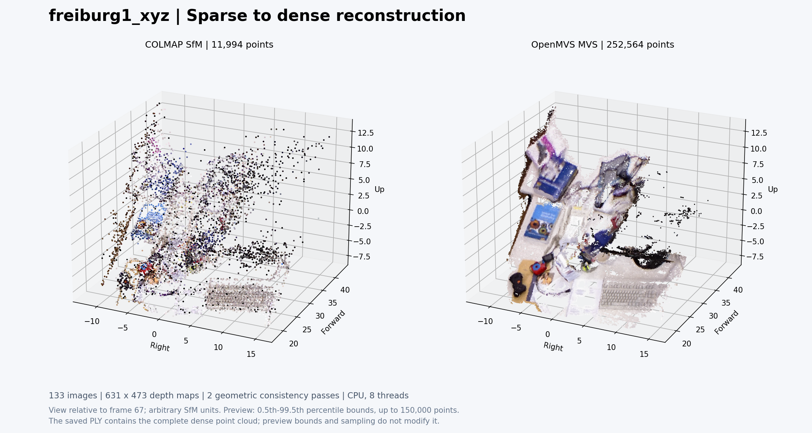
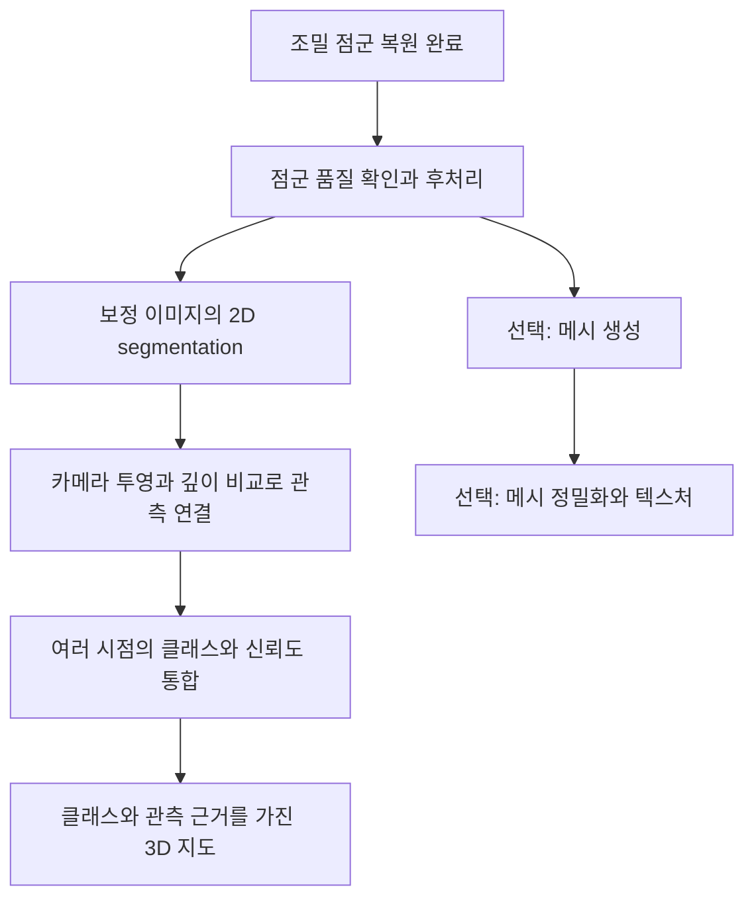

# spacewatch3d
nudix와 산학연계 협력 프로젝트입니다. by kdj

개요:
영상으로부터 카메라의 위치·자세와 장면의 깊이를 추정하여 공통 좌표계의 3D 포인트클라우드 지도를 생성한다. 
gps가 사용 가능하다면 보조 정도... gps로 카메라 방향을 알 수는 없으니깐
프레임(모든 프레임 또는 키 프레임)에 2D segmentation을 적용하고, 분할 영역의 클래스 정보를 실제로 관측된 3D 점에 주입(투영)한다. 
여러 프레임에서 관측된 동일 표면의 클래스별 분류 결과를 집계하여 최종 클래스를 결정한다. 관측이 부족하거나 결과가 충돌하는 영역은 미확정으로 관리하고, 관측 시각과 근거 프레임을 연결해 저장한다.
초기에는 천장·벽·바닥·의자처럼 고정된 클래스 집합을 사용한다. 이후에는 대표 프레임에서 VLM으로 클래스 후보를 추출하고, 이름을 표준화한 공통 클래스 목록을 텍스트 기반 segmentation에 활용하여 확장한다.
초기에는 rgb 영상으로 진행하고 추후에 360도 카메라로 확장할 수 있도록 설계한다.

사용할 라이브러리:
COLMAP + (PyCOLMAP) + OpenMVS + Open3D
일반 RGB 영상으로 시작하기 좋고, 나중에 segmentation 연결·촬영 회차 비교·재구성 모델 교체하기 용이함. 
영상 프레임 추출에는 FFmpeg나 OpenCV를 사용.
나중에 360도로 확장은 파노라마를 여러 방향의 일반 시야각 영상으로 변환하는 방식을 사용

SfM: structure from motion (이미지를 입력으로 받아 point cloud 생성) 
MVS: multi view stereo (SfM을 이용해 dense한 3D 모델 + dense한 point cloud 생성)

--- 계획중인 파이프라인 ---
1. rbg 영상 입력으로 받음 (.avi)
2. 초당 3~5 프레임만 추출해서 이미지 파일로 만들기
3-a. 이미지 파일들로 COLMAP에서 SfM 생성
3-b. 이미지 파일들로 SAM2나 SAM3에서 segmentaion mask 생성
4. 3-a의 SfM 결과로 OpenMVS에서 MVS 생성 -> MVS 결과 json으로 저장
5. MVS의 각 점들에 대해서 모든 이미지의 segmentaion mask 참고해서 클래스 주입 (시간 많이 걸릴거같은데 gpt는 괜찮다고 주장)

더 정해야하는 부분
1. rbg 영상 대신 360도 카메라를 입력으로 받도록 확장 필요
2. 위 연산들 gpu에서 가능한지, 가능하다면 얼마나 빨라지는지 확인 필요
3. 그래서 변화 탐지 어떻게할건지
4. segmentaion 시간 줄이기 위해 keyframe만 segmentaion 하는 아이디어 검증 필요

---이후는 gpt---


## `freiburg1_xyz` 프레임 추출

FFmpeg로 RGB 영상에서 초당 5장의 PNG 이미지를 추출했다. 아래는 저장 폴더를 처음 만들고 추출할 때 사용한 명령이며, 저장소 루트에서 실행한다. FFmpeg가 설치되어 있고 입력 영상이 해당 위치에 있어야 한다.

```bash
mkdir freiburg1_xyz_frames_5fps &&
ffmpeg -nostdin -n -hide_banner -loglevel warning \
  -i rgbd_dataset_freiburg1_xyz-rgb.avi \
  -map 0:v:0 \
  -vf 'fps=5' \
  -c:v png -pix_fmt rgb24 \
  freiburg1_xyz_frames_5fps/frame_%06d.png
```

- `-i`: 입력 영상 파일을 지정한다.
- `-map 0:v:0`: 첫 번째 입력의 첫 번째 비디오 스트림을 선택한다.
- `-vf 'fps=5'`: 초당 5장, 즉 0.2초 간격으로 출력한다.
- `-c:v png -pix_fmt rgb24`: 8비트 RGB 채널의 PNG 이미지로 저장한다.
- `frame_%06d.png`: 파일명을 `frame_000001.png`부터 순서대로 지정한다.
- `-nostdin -n`: 표준 입력을 통한 조작을 끄고 기존 파일을 덮어쓰지 않는다.
- `-hide_banner -loglevel warning`: 시작 배너를 생략하고 경고와 오류를 출력한다.

## SfM 결과 저장 위치와 확인 기준

입력 이미지는 `freiburg1_xyz_frames_5fps/`의 PNG 133장을 사용하고, 복원 결과는 `sfm_freiburg1_xyz_5fps/`에 저장한다.

저장소 루트에서 결과 폴더를 생성한 명령:

```bash
mkdir -p sfm_freiburg1_xyz_5fps/sparse sfm_freiburg1_xyz_5fps/logs
```

```text
sfm_freiburg1_xyz_5fps/
├── database.db          # 특징점과 이미지 간 매칭 정보
├── sparse/0/            # COLMAP 원본 모델: cameras.bin, images.bin, points3D.bin, project.ini
├── sparse_txt/0/        # 모델의 텍스트 사본: cameras.txt, images.txt, points3D.txt
├── sparse.ply           # 색상을 포함한 희소 포인트클라우드
├── sparse_overview.png  # 점군과 프레임 순서에 따른 카메라 경로 그림
├── dense/
│   ├── images/          # 렌즈 왜곡을 보정한 PNG 133장
│   ├── sparse/          # 보정 이미지에 맞춘 PINHOLE 카메라와 희소 모델
│   └── stereo/          # COLMAP이 만든 설정 파일과 빈 깊이/법선 폴더
├── openmvs/
│   ├── scene.mvs        # COLMAP에서 변환한 카메라·희소점·이미지 참조
│   ├── scene_dense.mvs  # 카메라·조밀 점군·관측 정보를 포함한 작업 모델
│   ├── scene_dense.ply  # 조밀 점군의 좌표·색상·법선
│   ├── depth*.dmap     # OpenMVS 깊이 지도 133개
│   ├── densify.cfg     # 깊이 추정에 사용한 설정
│   ├── view_neighbors.txt # 저장 모델에서 내보낸 이웃 이미지 목록
│   └── dense_overview.png # 희소·조밀 점군 비교 미리보기
└── logs/                # 단계별 실행 로그, 결과 통계, 검증 결과, GUI 캡처
```

`database.db`는 특징점 추출 단계에서 COLMAP이 생성한다. 복원 실행 시 `sparse/` 아래에 `0/`, `1/` 등의 모델 폴더가 생성될 수 있다.

복원 후에는 각 모델에 대해 다음 항목을 확인한다. 수치와 모델 모양을 함께 보고 결과를 판단한다.

| 확인 항목 | 확인 기준 및 기록할 내용 |
|---|---|
| 등록된 이미지 | 입력 133장 중 카메라 자세가 복원된 이미지 수와 비율을 기록하고, 등록되지 않은 프레임을 확인한다. |
| 모델 연결 상태 | 가능한 한 전체 영상이 하나의 모델로 연결되는 것을 목표로 한다. 여러 모델로 분리되면 각 모델의 등록 이미지 수와 포함된 영상 구간을 비교한다. |
| 희소 3D 점 | 점 수를 기록하고, GUI에서 책상과 주변 물체에 점이 분포하는지 확인한다. 특정 작은 영역에만 점이 몰리거나 멀리 떨어진 이상점이 많은지 살펴본다. |
| 관측 연결 | 평균 트랙 길이(3D 점 하나를 관측한 이미지 수)를 기록해 여러 프레임에서 같은 점을 관측했는지 확인한다. |
| 재투영 오차 | 평균 재투영 오차를 픽셀 단위로 기록한다. 설정을 비교할 때 등록 이미지 수와 점군의 모양도 함께 확인한다. |
| 카메라 경로와 장면 형태 | GUI에서 프레임 순서에 따른 카메라 이동이 자연스러운지, 장면이 중복되거나 심하게 휘어 보이지 않는지 확인한다. |
| 결과 파일과 로그 | 모델 폴더의 `cameras.bin`, `images.bin`, `points3D.bin`을 확인하고, 실행 오류와 결과 통계를 `logs/`에 보관한다. |

결과 통계는 `colmap model_analyzer`로 확인하고, 카메라 배치와 점군은 COLMAP GUI로 살펴본다. RGB 기반 단안 SfM 결과의 크기는 임의 스케일이므로, 실제 미터 단위의 거리 검증은 별도의 스케일 정렬 후 수행한다.

## COLMAP SfM 실행 과정

실행 환경은 Ubuntu 22.04.5 LTS, COLMAP 3.7(CUDA 미포함)이다. 아래 명령은 모두 저장소 루트에서 실행한다. CPU 스레드는 8개를 사용하며, 각 단계의 표준 출력과 오류를 `logs/`에 저장한다.

### 1. 특징점 추출

```bash
colmap feature_extractor \
  --database_path sfm_freiburg1_xyz_5fps/database.db \
  --image_path freiburg1_xyz_frames_5fps \
  --ImageReader.camera_model SIMPLE_RADIAL \
  --ImageReader.single_camera 1 \
  --SiftExtraction.use_gpu 0 \
  --SiftExtraction.num_threads 8 \
  > sfm_freiburg1_xyz_5fps/logs/01_feature_extractor.log 2>&1
```

133장 모두에서 SIFT 특징점을 추출했다. 특징점은 이미지당 최소 1,016개, 평균 약 2,237개, 최대 3,248개이며, 총 297,524개다. 이는 2D 특징점 수이며 복원된 3D 점 수와는 다르다.

`SIMPLE_RADIAL` 모델의 내부 파라미터를 모든 이미지가 공유한다. 별도의 TUM 보정값은 입력하지 않았으며, COLMAP 3.7 기본값인 `f=768`, `cx=320`, `cy=240`, `k=0`에서 시작한다. 복원 중 초점거리와 왜곡 계수는 보정하고 중심점은 고정하는 기본 설정을 사용한다.

### 2. 전체 이미지 쌍 매칭

```bash
colmap exhaustive_matcher \
  --database_path sfm_freiburg1_xyz_5fps/database.db \
  --SiftMatching.use_gpu 0 \
  --SiftMatching.num_threads 8 \
  --SiftMatching.guided_matching 1 \
  > sfm_freiburg1_xyz_5fps/logs/02_exhaustive_matcher.log 2>&1
```

전체 8,778개 이미지 쌍을 비교하고 기하 검증을 수행한다. `guided_matching`은 추정된 이미지 간 기하 관계를 활용해 추가 대응점을 찾는 설정이다.

매칭은 약 9.08분 걸렸으며, 8,132쌍에서 기하 검증을 통과한 대응점을 얻었다. 나머지 646쌍은 유효한 대응점을 확보하지 못했다.

### 3. 카메라 자세와 희소 지도 복원

```bash
colmap mapper \
  --database_path sfm_freiburg1_xyz_5fps/database.db \
  --image_path freiburg1_xyz_frames_5fps \
  --output_path sfm_freiburg1_xyz_5fps/sparse \
  --Mapper.num_threads 8 \
  > sfm_freiburg1_xyz_5fps/logs/03_mapper.log 2>&1
```

초기 이미지 쌍에서 시작해 카메라 자세 추정, 3D 점 삼각측량, 번들 조정을 반복한다. TUM의 깊이 영상과 정답 궤적은 사용하지 않는다.

### 4. 결과 분석과 내보내기

```bash
colmap model_analyzer \
  --path sfm_freiburg1_xyz_5fps/sparse/0 \
  > sfm_freiburg1_xyz_5fps/logs/04_model_analyzer.log 2>&1

mkdir -p sfm_freiburg1_xyz_5fps/sparse_txt/0

colmap model_converter \
  --input_path sfm_freiburg1_xyz_5fps/sparse/0 \
  --output_path sfm_freiburg1_xyz_5fps/sparse_txt/0 \
  --output_type TXT \
  > sfm_freiburg1_xyz_5fps/logs/05_export_txt.log 2>&1

colmap model_converter \
  --input_path sfm_freiburg1_xyz_5fps/sparse/0 \
  --output_path sfm_freiburg1_xyz_5fps/sparse.ply \
  --output_type PLY \
  > sfm_freiburg1_xyz_5fps/logs/06_export_ply.log 2>&1
```

`sparse/0/`은 재사용할 원본 모델이며, `sparse_txt/0/`은 내용을 읽기 위한 텍스트 사본이다. `sparse.ply`는 점의 좌표와 색상을 담고 있으므로, 카메라 자세와 관측 연결 정보까지 보존하려면 원본 모델도 함께 보관한다.

### 5. GUI 확인

복원 모델을 COLMAP GUI에 불러왔다. 다음 명령으로 같은 모델을 다시 열 수 있다.

```bash
colmap gui \
  --database_path sfm_freiburg1_xyz_5fps/database.db \
  --image_path freiburg1_xyz_frames_5fps \
  --import_path sfm_freiburg1_xyz_5fps/sparse/0
```

GUI 실행 로그는 `logs/07_gui.log`, 화면 캡처는 `logs/09_gui.png`에 저장했다. 화면에서 점이 작게 보이면 `Ctrl`을 누른 채 마우스 휠로 점 크기를 조정할 수 있다. 일반 휠은 확대·축소, 왼쪽 드래그는 회전이다. [COLMAP GUI 조작 안내](https://colmap.github.io/gui.html)

### 복원 결과 (2026-09-13)

| 항목 | 결과 |
|---|---|
| 연결된 모델 | 1개 (`sparse/0/`) |
| 등록된 이미지 / 카메라 자세 | 133 / 133장 (100%) |
| 공유 내부 파라미터 | 1개 카메라 모델 |
| 희소 3D 점 | 11,994개 |
| 2D–3D 관측 연결 | 267,341개 |
| 평균 트랙 길이 | 22.289561개 이미지 / 3D 점 |
| 이미지당 평균 3D 점 관측 수 | 2,010.082707개 |
| 평균 재투영 오차 | 1.373034px (`model_analyzer` 기준) |
| 최종 내부 파라미터 | `SIMPLE_RADIAL`: `f=543.450959`, `cx=320`, `cy=240`, `k=0.022052325` |
| 특징점 추출 시간 | 약 0.21분 |
| 매칭 시간 | 약 9.08분 |
| SfM 복원 시간 | 약 4.64분 |

특징점 추출·매칭·복원은 모두 종료 코드 0으로 완료됐다. 텍스트 모델을 추가로 검사해 입력 파일 133장이 모두 등록됐으며, 카메라 중심과 3D 점 좌표가 모두 유한한 값이고, 저장된 관측 중 해당 카메라 뒤쪽에 놓인 점은 0개임을 확인했다. 이 검사 결과는 `logs/08_validation.json`에 기록했다.

`images.txt`의 회전과 이동은 월드 좌표에서 카메라 좌표로의 변환이다. 카메라 중심 위치는 이동 벡터 자체가 아니라 `C = -Rᵀt`로 계산했다. [COLMAP 출력 형식](https://colmap.github.io/format.html#images-txt)

아래 그림은 텍스트 모델을 NumPy·SciPy·Matplotlib으로 시각화한 것이다. 왼쪽은 희소 점군과 카메라 위치, 오른쪽은 파일명 순서로 연결한 카메라 경로다. 표시 좌표는 67번째 프레임의 카메라를 기준으로 변환했으며, 원본 모델 좌표는 변경하지 않았다. 점군 그림의 축 범위는 각 좌표의 1–99백분위수를 참고해 정했고, 저장된 모델의 점을 삭제하지는 않았다.


세 방향으로 왕복하는 카메라 이동 형태를 확인했다. 다만 정답 궤적과 정렬해 비교하지 않았으므로 실제 거리·자세 정확도는 아직 평가하지 않았다. 이 SfM 단계의 결과는 RGB 영상만으로 복원한 임의 스케일의 희소 지도다. 이후 아래 과정으로 깊이 지도와 조밀 점군을 생성했다.

## 렌즈 왜곡 보정과 OpenMVS 모델 변환

COLMAP 3.7로 등록한 133장에 렌즈 왜곡 보정을 적용하고, OpenMVS 2.4.0으로 모델을 변환했다. 아래 명령은 저장소 루트에서 실행한 작업을 정리한 것이며, 이미 생성된 결과를 재계산할 필요는 없다.

```bash
mkdir -p sfm_freiburg1_xyz_5fps/dense
colmap image_undistorter \
  --image_path freiburg1_xyz_frames_5fps \
  --input_path sfm_freiburg1_xyz_5fps/sparse/0 \
  --output_path sfm_freiburg1_xyz_5fps/dense \
  --output_type COLMAP \
  --max_image_size 640 \
  > sfm_freiburg1_xyz_5fps/logs/10_image_undistorter.log 2>&1

mkdir -p sfm_freiburg1_xyz_5fps/openmvs
InterfaceCOLMAP \
  --working-folder "$(pwd)/sfm_freiburg1_xyz_5fps/logs" \
  --input-file "$(pwd)/sfm_freiburg1_xyz_5fps/dense" \
  --output-file "$(pwd)/sfm_freiburg1_xyz_5fps/openmvs/scene.mvs" \
  --image-folder "$(pwd)/sfm_freiburg1_xyz_5fps/dense/images" \
  --max-threads 8 \
  > sfm_freiburg1_xyz_5fps/logs/11_interface_colmap.log 2>&1
```

보정된 이미지의 크기는 631×473이며, 공유 카메라 모델은 `PINHOLE`이다. 내부 파라미터는 `fx=fy=543.450959`, `cx=315.5`, `cy=236.5`다. 이후 이미지 분할과 3D 투영에도 이 보정 이미지와 대응 카메라를 함께 사용한다.

모델 변환에서 카메라 자세 133개와 희소점 11,994개가 옮겨졌고, 이미지 133장의 참조 경로가 모두 존재함을 확인했다. `scene.mvs`의 이미지 참조는 `../dense/images/…` 형식이므로 두 폴더의 상대 위치를 유지한다. 변환 검증 기록은 [12_openmvs_conversion_validation.json](sfm_freiburg1_xyz_5fps/logs/12_openmvs_conversion_validation.json)에 있다.

`dense/stereo/`와 `dense/run-colmap-*.sh`는 COLMAP 왜곡 보정 과정에서 자동 생성됐다. 해당 스크립트나 COLMAP의 조밀 복원은 실행하지 않았으며, 실제 깊이 지도는 다음 OpenMVS 작업으로 `openmvs/`에 생성했다. [OpenMVS의 COLMAP 변환 안내](https://github.com/cdcseacave/openMVS/wiki/Usage#convert-sfm-scene-from-colmap)

## OpenMVS MVS 복원 실행 과정

### 실행 환경과 명령

Ubuntu 22.04.5 LTS에서 OpenMVS 2.4.0 CPU 빌드를 사용했다. 실행 파일은 사용자 경로 `/home/kdj/.local/opt/openmvs/2.4.0/bin/OpenMVS/`에 설치되어 있고, `/home/kdj/.local/bin/`의 링크로 호출한다. 이번 설치에는 CUDA와 GUI Viewer가 포함되지 않았다.

다음 명령 한 번으로 이웃 이미지 선택, PatchMatch 깊이 추정, 기하학적 일관성 검사, 깊이 통합을 순서대로 수행했다. `--working-folder`를 모델 폴더로 지정해 이미지의 상대 경로를 해석하고 깊이 지도를 같은 폴더에 저장한다.

```bash
DensifyPointCloud \
  --working-folder "$(pwd)/sfm_freiburg1_xyz_5fps/openmvs" \
  --input-file scene.mvs \
  --output-file scene_dense.mvs \
  --archive-type 2 \
  --resolution-level 0 \
  --max-resolution 640 \
  --min-resolution 320 \
  --number-views 5 \
  --iters 3 \
  --geometric-iters 2 \
  --number-views-fuse 2 \
  --fusion-mode 0 \
  --fusion-filter 2 \
  --estimate-colors 2 \
  --estimate-normals 2 \
  --max-threads 8 \
  --tower-mode 0 \
  --estimate-roi 0 \
  --crop-to-roi 0 \
  --remove-dmaps 0 \
  --dense-config-file densify.cfg \
  > sfm_freiburg1_xyz_5fps/logs/13_densify_point_cloud.log 2>&1
```

| 단계 | 사용한 설정과 처리 내용 |
|---|---|
| 겹치는 이미지 선택 | 133장 모두 처리 가능했으며, 각 깊이 지도에는 기준 이미지와 선택된 이웃 이미지 5장이 기록됐다. |
| PatchMatch 깊이 추정 | `resolution-level=0`으로 보정 해상도 631×473을 유지했다. `iters=3`으로 초기 깊이를 추정했다. |
| 여러 시점에서 일관성 확인 | `geometric-iters=2`로 다른 시점의 깊이와 일치하도록 133장 전체에 두 차례 기하학적 검사를 수행했다. |
| 깊이를 3D 점으로 변환·통합 | `fusion-mode=0`, `fusion-filter=2`로 깊이를 통합하고 필터링했다. `number-views-fuse=2`로 최소 두 시점의 일치를 요구했다. |

CPU 스레드는 8개를 사용했다. `tower-mode=0`으로 타워 촬영용 처리를 끄고, 자동 관심 영역 추정과 해당 영역으로 자르기도 비활성화했다. `remove-dmaps=0`으로 후속 투영·검증에 사용할 깊이 지도를 보관했다. `archive-type=2`로 카메라와 조밀 점군 정보를 압축된 OpenMVS 작업 모델에 저장했다. [OpenMVS 조밀 복원 안내](https://github.com/cdcseacave/openMVS/wiki/Usage#dense-point-cloud-reconstruction-optional)

### 복원 결과와 검증 (2026-09-13)

| 항목 | 결과 |
|---|---|
| 입력 / 처리 이미지 | 133 / 133장 |
| 깊이 지도 | 133개, 각각 631×473 |
| 기하학적 일관성 검사 | 전체 이미지에 2회 완료 |
| 최종 조밀 3D 점 | 252,564개 |
| 희소점 대비 점 수 | 약 21.06배 (`11,994 → 252,564`) |
| 유효 깊이 픽셀 비율 | 이미지당 평균 62.06%, 최소 35.10%, 최대 77.57% |
| 실행 시간 | 507.24초, 약 8분 27초 |
| 실행 종료 코드 | 0 |
| 저장 모델 재로딩 | 카메라 자세 133개, 조밀점 252,564개 확인 |
| 메시 / 텍스처 | 생성하지 않음 |

깊이 지도 133개의 파일 구조, 해상도, 이미지 참조, 깊이 값과 카메라 행렬을 검사했다. 모든 깊이 값은 유한하고 음수가 아니었으며, 각 지도에 양의 깊이가 존재했다. 0은 유효 깊이가 없는 픽셀로 집계했다. 조밀 점군의 좌표와 법선도 모두 유한한 값이고, 변환 입력인 `scene.mvs`는 해시 비교 결과 변경되지 않았다.

유효 깊이 픽셀 비율과 점 수 증가는 정확도 점수가 아니다. 정답 깊이·궤적과 비교하지 않았고, 일부 빈 영역과 잡음이 남아 있다. 좌표와 깊이는 RGB 기반 SfM의 임의 스케일이며, TUM 깊이 센서 데이터는 사용하지 않았다.

| 파일 | 용도 |
|---|---|
| [scene_dense.ply](sfm_freiburg1_xyz_5fps/openmvs/scene_dense.ply) | 좌표·색상·법선을 가진 조밀 점군. 시각화와 후처리에 사용한다. |
| [scene_dense.mvs](sfm_freiburg1_xyz_5fps/openmvs/scene_dense.mvs) | 카메라·조밀점·관측 정보를 보관하는 후속 작업용 모델. 이미지 자체는 별도 파일로 참조한다. |
| `openmvs/depth*.dmap` | 이미지별 깊이·법선·신뢰도와 카메라·선택된 이웃 정보. 파일 번호는 이미지 ID이며 프레임 파일명 번호와 같다고 가정하면 안 된다. |
| [view_neighbors.txt](sfm_freiburg1_xyz_5fps/openmvs/view_neighbors.txt) | 저장 모델에서 내보낸 이웃 이미지 목록. 깊이 추정에 실제 사용한 5장의 ID는 각 `.dmap` 및 검증 JSON에 기록되어 있다. |
| [13_densify_point_cloud.log](sfm_freiburg1_xyz_5fps/logs/13_densify_point_cloud.log) | 실행 명령과 단계별 진행·완료 로그. |
| [14_mvs_run.json](sfm_freiburg1_xyz_5fps/logs/14_mvs_run.json) | 전체 명령 인자, 시작·종료 시각, 소요 시간, 입력 해시. |
| [15_mvs_validation.json](sfm_freiburg1_xyz_5fps/logs/15_mvs_validation.json) | 전체 통계와 이미지별 깊이 지도 검증 결과. |
| [16_mvs_model_readback.log](sfm_freiburg1_xyz_5fps/logs/16_mvs_model_readback.log) | 저장 모델을 다시 읽고 이웃 목록만 내보낸 검증 로그. 이 확인 과정에서 복원을 재실행하지 않았다. |

PLY만으로는 원래 카메라와 점별 관측 정보를 모두 복구할 수 없으므로, 후속 작업을 위해 `.mvs`, 보정 이미지, 카메라 모델, 깊이 지도를 함께 보관한다.



비교 그림은 67번째 프레임 카메라 기준으로 표시했다. 두 패널의 축 범위는 조밀점 좌표의 0.5–99.5백분위수로 맞췄고, 표시 점은 최대 150,000개를 표본 추출했다. 저장된 PLY에는 전체 252,564개 점이 그대로 있다.

### COLMAP GUI에서 조밀 점군 열기 (2026-09-14)

COLMAP 3.7의 `File → Import model from…`에서 원본 `scene_dense.ply`를 열면 프로그램이 종료되는 문제를 재현했다. OpenMVS가 RGB 자료형을 `uint8`로 기록하지만, COLMAP 3.7의 PLY 읽기 코드는 이 별칭을 지원하지 않고 `uchar`를 요구한다. 점군 손상이 아니라 파일 헤더의 자료형 표기 호환성 문제다. [COLMAP 3.7 PLY 읽기 코드](https://github.com/colmap/colmap/blob/3.7/src/util/ply.cc#L130-L134)

원본을 보존하고 RGB의 `property uint8` 세 줄만 `property uchar`로 바꾼 [scene_dense_colmap.ply](sfm_freiburg1_xyz_5fps/openmvs/scene_dense_colmap.ply)를 만들었다. 헤더 뒤의 좌표·색상·법선 데이터는 원본과 바이트 단위로 동일하며, 점 삭제·이동·다운샘플링은 적용하지 않았다.

터미널에서 `colmap gui`를 실행한 뒤 **File → Import model from…**에서 이 호환 사본을 선택한다. GUI 하단의 **252564 Points** 표시와 회전·이동·확대가 정상 동작하는 것을 직접 확인했다. PLY에는 카메라 모델이 포함되지 않으므로 **0 Images** 표시는 정상이다.

검증 기록은 [17_colmap_ply_compatibility.json](sfm_freiburg1_xyz_5fps/logs/17_colmap_ply_compatibility.json), 원본을 열 때의 오류는 [18_colmap_gui_original_error.log](sfm_freiburg1_xyz_5fps/logs/18_colmap_gui_original_error.log), 정상 로딩 화면은 [19_colmap_gui_dense.png](sfm_freiburg1_xyz_5fps/logs/19_colmap_gui_dense.png)에 저장했다.

## 앞으로의 파이프라인

현재 완료한 범위는 `RGB 영상 → FFmpeg 5fps 프레임 → COLMAP SfM → 렌즈 왜곡 보정 → OpenMVS 변환 → 조밀 점군 복원`이다. 아래는 앞으로 수행할 계획이며 아직 실행하지 않았다.

프로젝트의 우선 목표는 클래스와 관측 근거를 가진 3D 점군 지도다. 먼저 조밀 점군을 점검한 뒤 보정 이미지의 2D 분할 결과를 3D 점에 연결하는 순서로 진행한다.



| 순서 | 할 작업 | 산출물·확인 기준 |
|---|---|---|
| 1. 점군 품질 확인·후처리 | Open3D 등의 뷰어에서 빈 영역과 고립점을 확인하고, 필요하면 이상점 제거와 voxel downsampling을 적용한다. | 원본과 별도의 정리된 점군. 제거 전후 점 수와 물체 형태를 비교하고, 원본 점 ID와 대응 관계를 보존한다. 필터 거리 기준은 현재 임의 스케일에 맞춰 정한다. |
| 2. 프레임·카메라 연결 정리 | 보정 이미지 파일명, COLMAP 이미지 ID, 카메라 파라미터, 깊이 지도 ID, 영상 내 시각을 연결한다. | 프레임 메타데이터. 현재 AVI의 상대 시각과 TUM 원본 센서 타임스탬프를 구분한다. |
| 3. 2D segmentation | 보정 이미지에 고정된 클래스 목록으로 분할을 적용한다. 사용할 모델과 추론 환경은 이 단계에서 선정·검증한다. | 이미지별 클래스 마스크와 제공 가능한 신뢰도. 리사이즈한 추론 결과는 631×473 좌표에 정확히 대응시킨다. |
| 4. 2D–3D 관측 연결 | 3D 점을 각 보정 이미지에 투영하고, 화면 범위와 양의 깊이, 해당 `.dmap`과의 깊이 일치를 검사한다. | 실제로 보이는 점에만 라벨 후보를 연결한다. 카메라 뒤쪽 점과 다른 물체에 가려진 점은 해당 프레임의 투표에서 제외한다. |
| 5. 여러 시점의 라벨 통합 | 분할 신뢰도, 관측 횟수, 시점 등을 고려해 점별 클래스를 집계한다. 비슷한 연속 프레임의 중복 투표도 고려한다. | 점별 클래스·신뢰도·관측 수. 관측 부족이나 클래스 충돌은 `unknown`으로 남긴다. |
| 6. 의미 지도 저장·평가 | `point_id`, `xyz`, `rgb`, `class_id`, 신뢰도와 근거 프레임·시각을 함께 저장한다. | 클래스별 색상 시각화, 대표 프레임 재투영, 수작업 정답 일부와의 비교로 잘못 연결된 라벨을 점검한다. |

점군 후처리에는 통계 기반 또는 반경 기반 이상점 제거를 검토할 수 있다. 현재 단계에서 이러한 추가 후처리는 아직 실행하지 않았다. [Open3D 점군 이상점 제거 안내](https://www.open3d.org/docs/release/tutorial/geometry/pointcloud_outlier_removal.html)

투영에는 보정된 카메라의 `K`와 월드→카메라 변환 `Xc = R·Xw + t`를 사용한다. `u = fx·Xc.x/Xc.z + cx`, `v = fy·Xc.y/Xc.z + cy`로 픽셀 위치를 구하고, `Xc.z`를 같은 이미지의 깊이와 비교한다. 왜곡 보정 전 640×480 이미지의 좌표나 내부 파라미터를 섞지 않는다. [COLMAP 카메라 자세 형식](https://colmap.github.io/format.html#images-txt)

삼각형 표면 모델이 필요하면 `ReconstructMesh → RefineMesh(선택) → TextureMesh(선택)`를 진행한다. 각각 점군에서 표면 생성, 이미지에 맞춘 표면 정밀화, 사진 기반 텍스처 생성을 담당한다. 이 경로는 3D 점에 클래스를 붙이기 위한 필수 단계는 아니다. OpenMVS 후속 도구에는 관측 정보가 있는 `scene_dense.mvs`를 기본 입력으로 사용한다. [OpenMVS 메시 생성·정밀화·텍스처 안내](https://github.com/cdcseacave/openMVS/wiki/Usage#rough-mesh-reconstruction)

의미 지도까지 검증한 뒤에는 고정 클래스 목록을 VLM이 제안한 후보와 연결하고, 여러 촬영 회차의 스케일·좌표 정렬 및 변화 비교로 확장한다. 360도 영상은 시야를 나눈 이미지와 각 시야의 카메라 모델을 일관되게 관리하는 별도 입력 경로로 추가할 계획이다.
