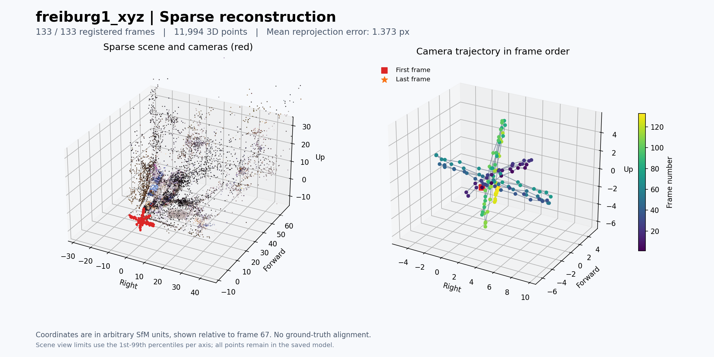

# spacewatch3d
nudix와 산학연계 협력 프로젝트입니다. by kdj

개요:
영상으로부터 카메라의 위치·자세와 장면의 깊이를 추정하여 공통 좌표계의 3D 포인트클라우드 지도를 생성한다. 
gps가 사용 가능하다면 보조 정도... gps로 카메라 방향을 알 수는 없으니깐
프레임(모든 프레임 또는 키 프레임)에 2D segmentation을 적용하고, 분할 영역의 클래스 정보를 실제로 관측된 3D 점에 주입(투영)한다. 
여러 프레임에서 관측된 동일 표면의 클래스별 분류 결과를 집계하여 최종 클래스를 결정한다. 관측이 부족하거나 결과가 충돌하는 영역은 미확정으로 관리하고, 관측 시각과 근거 프레임을 연결해 저장한다.
초기에는 천장·벽·바닥·의자처럼 고정된 클래스 집합을 사용한다. 이후에는 대표 프레임에서 VLM으로 클래스 후보를 추출하고, 이름을 표준화한 공통 클래스 목록을 텍스트 기반 segmentation에 활용하여 확장한다.
초기에는 rgb 영상으로 진행하고 추후에 360도 카메라로 확장할 수 있도록 설계한다.

사용할 라이브러리:
COLMAP + (PyCOLMAP) + Open3D
일반 RGB 영상으로 시작하기 좋고, 나중에 segmentation 연결·촬영 회차 비교·재구성 모델 교체하기 용이함. 
영상 프레임 추출에는 FFmpeg나 OpenCV를 사용.
나중에 360도로 확장은 파노라마를 여러 방향의 일반 시야각 영상으로 변환하는 방식을 사용

## TUM RGB-D `freiburg1_xyz` 프레임 추출

FFmpeg로 RGB 영상에서 초당 5장의 PNG 이미지를 추출했다. 아래는 저장 폴더를 처음 만들고 추출할 때 사용한 명령이며, 저장소 루트에서 실행한다. FFmpeg가 설치되어 있고 입력 영상이 해당 위치에 있어야 한다.

```bash
mkdir freiburg1_xyz_frames_5fps &&
ffmpeg -nostdin -n -hide_banner -loglevel warning \
  -i rgbd_dataset_freiburg1_xyz-rgb.avi \
  -map 0:v:0 \
  -vf 'fps=5' \
  -c:v png -pix_fmt rgb24 \
  freiburg1_xyz_frames_5fps/frame_%06d.png
```

- `-i`: 입력 영상 파일을 지정한다.
- `-map 0:v:0`: 첫 번째 입력의 첫 번째 비디오 스트림을 선택한다.
- `-vf 'fps=5'`: 초당 5장, 즉 0.2초 간격으로 출력한다.
- `-c:v png -pix_fmt rgb24`: 8비트 RGB 채널의 PNG 이미지로 저장한다.
- `frame_%06d.png`: 파일명을 `frame_000001.png`부터 순서대로 지정한다.
- `-nostdin -n`: 표준 입력을 통한 조작을 끄고 기존 파일을 덮어쓰지 않는다.
- `-hide_banner -loglevel warning`: 시작 배너를 생략하고 경고와 오류를 출력한다.

## SfM 결과 저장 위치와 확인 기준

입력 이미지는 `freiburg1_xyz_frames_5fps/`의 PNG 133장을 사용하고, 복원 결과는 `sfm_freiburg1_xyz_5fps/`에 저장한다.

저장소 루트에서 결과 폴더를 생성한 명령:

```bash
mkdir -p sfm_freiburg1_xyz_5fps/sparse sfm_freiburg1_xyz_5fps/logs
```

```text
sfm_freiburg1_xyz_5fps/
├── database.db          # 특징점과 이미지 간 매칭 정보
├── sparse/0/            # COLMAP 원본 모델: cameras.bin, images.bin, points3D.bin, project.ini
├── sparse_txt/0/        # 모델의 텍스트 사본: cameras.txt, images.txt, points3D.txt
├── sparse.ply           # 색상을 포함한 희소 포인트클라우드
├── sparse_overview.png  # 점군과 프레임 순서에 따른 카메라 경로 그림
└── logs/                # 단계별 실행 로그, 결과 통계, 검증 결과, GUI 캡처
```

`database.db`는 특징점 추출 단계에서 COLMAP이 생성한다. 복원 실행 시 `sparse/` 아래에 `0/`, `1/` 등의 모델 폴더가 생성될 수 있다.

`database.db`는 GitHub의 파일 크기 제한을 초과하여 Git 추적에서 제외한다. 저장소를 새로 받은 경우 아래 특징점 추출과 전체 이미지 쌍 매칭 명령으로 로컬에서 생성한다.

복원 후에는 각 모델에 대해 다음 항목을 확인한다. 수치와 모델 모양을 함께 보고 결과를 판단한다.

| 확인 항목 | 확인 기준 및 기록할 내용 |
|---|---|
| 등록된 이미지 | 입력 133장 중 카메라 자세가 복원된 이미지 수와 비율을 기록하고, 등록되지 않은 프레임을 확인한다. |
| 모델 연결 상태 | 가능한 한 전체 영상이 하나의 모델로 연결되는 것을 목표로 한다. 여러 모델로 분리되면 각 모델의 등록 이미지 수와 포함된 영상 구간을 비교한다. |
| 희소 3D 점 | 점 수를 기록하고, GUI에서 책상과 주변 물체에 점이 분포하는지 확인한다. 특정 작은 영역에만 점이 몰리거나 멀리 떨어진 이상점이 많은지 살펴본다. |
| 관측 연결 | 평균 트랙 길이(3D 점 하나를 관측한 이미지 수)를 기록해 여러 프레임에서 같은 점을 관측했는지 확인한다. |
| 재투영 오차 | 평균 재투영 오차를 픽셀 단위로 기록한다. 설정을 비교할 때 등록 이미지 수와 점군의 모양도 함께 확인한다. |
| 카메라 경로와 장면 형태 | GUI에서 프레임 순서에 따른 카메라 이동이 자연스러운지, 장면이 중복되거나 심하게 휘어 보이지 않는지 확인한다. |
| 결과 파일과 로그 | 모델 폴더의 `cameras.bin`, `images.bin`, `points3D.bin`을 확인하고, 실행 오류와 결과 통계를 `logs/`에 보관한다. |

결과 통계는 `colmap model_analyzer`로 확인하고, 카메라 배치와 점군은 COLMAP GUI로 살펴본다. RGB 기반 단안 SfM 결과의 크기는 임의 스케일이므로, 실제 미터 단위의 거리 검증은 별도의 스케일 정렬 후 수행한다.

## COLMAP SfM 실행 과정

실행 환경은 Ubuntu 22.04.5 LTS, COLMAP 3.7(CUDA 미포함)이다. 아래 명령은 모두 저장소 루트에서 실행한다. CPU 스레드는 8개를 사용하며, 각 단계의 표준 출력과 오류를 `logs/`에 저장한다.

### 1. 특징점 추출

```bash
colmap feature_extractor \
  --database_path sfm_freiburg1_xyz_5fps/database.db \
  --image_path freiburg1_xyz_frames_5fps \
  --ImageReader.camera_model SIMPLE_RADIAL \
  --ImageReader.single_camera 1 \
  --SiftExtraction.use_gpu 0 \
  --SiftExtraction.num_threads 8 \
  > sfm_freiburg1_xyz_5fps/logs/01_feature_extractor.log 2>&1
```

133장 모두에서 SIFT 특징점을 추출했다. 특징점은 이미지당 최소 1,016개, 평균 약 2,237개, 최대 3,248개이며, 총 297,524개다. 이는 2D 특징점 수이며 복원된 3D 점 수와는 다르다.

`SIMPLE_RADIAL` 모델의 내부 파라미터를 모든 이미지가 공유한다. 별도의 TUM 보정값은 입력하지 않았으며, COLMAP 3.7 기본값인 `f=768`, `cx=320`, `cy=240`, `k=0`에서 시작한다. 복원 중 초점거리와 왜곡 계수는 보정하고 중심점은 고정하는 기본 설정을 사용한다.

### 2. 전체 이미지 쌍 매칭

```bash
colmap exhaustive_matcher \
  --database_path sfm_freiburg1_xyz_5fps/database.db \
  --SiftMatching.use_gpu 0 \
  --SiftMatching.num_threads 8 \
  --SiftMatching.guided_matching 1 \
  > sfm_freiburg1_xyz_5fps/logs/02_exhaustive_matcher.log 2>&1
```

전체 8,778개 이미지 쌍을 비교하고 기하 검증을 수행한다. `guided_matching`은 추정된 이미지 간 기하 관계를 활용해 추가 대응점을 찾는 설정이다.

매칭은 약 9.08분 걸렸으며, 8,132쌍에서 기하 검증을 통과한 대응점을 얻었다. 나머지 646쌍은 유효한 대응점을 확보하지 못했다.

### 3. 카메라 자세와 희소 지도 복원

```bash
colmap mapper \
  --database_path sfm_freiburg1_xyz_5fps/database.db \
  --image_path freiburg1_xyz_frames_5fps \
  --output_path sfm_freiburg1_xyz_5fps/sparse \
  --Mapper.num_threads 8 \
  > sfm_freiburg1_xyz_5fps/logs/03_mapper.log 2>&1
```

초기 이미지 쌍에서 시작해 카메라 자세 추정, 3D 점 삼각측량, 번들 조정을 반복한다. TUM의 깊이 영상과 정답 궤적은 사용하지 않는다.

### 4. 결과 분석과 내보내기

```bash
colmap model_analyzer \
  --path sfm_freiburg1_xyz_5fps/sparse/0 \
  > sfm_freiburg1_xyz_5fps/logs/04_model_analyzer.log 2>&1

mkdir -p sfm_freiburg1_xyz_5fps/sparse_txt/0

colmap model_converter \
  --input_path sfm_freiburg1_xyz_5fps/sparse/0 \
  --output_path sfm_freiburg1_xyz_5fps/sparse_txt/0 \
  --output_type TXT \
  > sfm_freiburg1_xyz_5fps/logs/05_export_txt.log 2>&1

colmap model_converter \
  --input_path sfm_freiburg1_xyz_5fps/sparse/0 \
  --output_path sfm_freiburg1_xyz_5fps/sparse.ply \
  --output_type PLY \
  > sfm_freiburg1_xyz_5fps/logs/06_export_ply.log 2>&1
```

`sparse/0/`은 재사용할 원본 모델이며, `sparse_txt/0/`은 내용을 읽기 위한 텍스트 사본이다. `sparse.ply`는 점의 좌표와 색상을 담고 있으므로, 카메라 자세와 관측 연결 정보까지 보존하려면 원본 모델도 함께 보관한다.

### 5. GUI 확인

복원 모델을 COLMAP GUI에 불러왔다. 다음 명령으로 같은 모델을 다시 열 수 있다.

```bash
colmap gui \
  --database_path sfm_freiburg1_xyz_5fps/database.db \
  --image_path freiburg1_xyz_frames_5fps \
  --import_path sfm_freiburg1_xyz_5fps/sparse/0
```

GUI 실행 로그는 `logs/07_gui.log`, 화면 캡처는 `logs/09_gui.png`에 저장했다. 화면에서 점이 작게 보이면 `Ctrl`을 누른 채 마우스 휠로 점 크기를 조정할 수 있다. 일반 휠은 확대·축소, 왼쪽 드래그는 회전이다. [COLMAP GUI 조작 안내](https://colmap.github.io/gui.html)

### 복원 결과 (2026-09-13)

| 항목 | 결과 |
|---|---|
| 연결된 모델 | 1개 (`sparse/0/`) |
| 등록된 이미지 / 카메라 자세 | 133 / 133장 (100%) |
| 공유 내부 파라미터 | 1개 카메라 모델 |
| 희소 3D 점 | 11,994개 |
| 2D–3D 관측 연결 | 267,341개 |
| 평균 트랙 길이 | 22.289561개 이미지 / 3D 점 |
| 이미지당 평균 3D 점 관측 수 | 2,010.082707개 |
| 평균 재투영 오차 | 1.373034px (`model_analyzer` 기준) |
| 최종 내부 파라미터 | `SIMPLE_RADIAL`: `f=543.450959`, `cx=320`, `cy=240`, `k=0.022052325` |
| 특징점 추출 시간 | 약 0.21분 |
| 매칭 시간 | 약 9.08분 |
| SfM 복원 시간 | 약 4.64분 |

특징점 추출·매칭·복원은 모두 종료 코드 0으로 완료됐다. 텍스트 모델을 추가로 검사해 입력 파일 133장이 모두 등록됐으며, 카메라 중심과 3D 점 좌표가 모두 유한한 값이고, 저장된 관측 중 해당 카메라 뒤쪽에 놓인 점은 0개임을 확인했다. 이 검사 결과는 `logs/08_validation.json`에 기록했다.

`images.txt`의 회전과 이동은 월드 좌표에서 카메라 좌표로의 변환이다. 카메라 중심 위치는 이동 벡터 자체가 아니라 `C = -Rᵀt`로 계산했다. [COLMAP 출력 형식](https://colmap.github.io/format.html#images-txt)

아래 그림은 텍스트 모델을 NumPy·SciPy·Matplotlib으로 시각화한 것이다. 왼쪽은 희소 점군과 카메라 위치, 오른쪽은 파일명 순서로 연결한 카메라 경로다. 표시 좌표는 67번째 프레임의 카메라를 기준으로 변환했으며, 원본 모델 좌표는 변경하지 않았다. 점군 그림의 축 범위는 각 좌표의 1–99백분위수를 참고해 정했고, 저장된 모델의 점을 삭제하지는 않았다.



세 방향으로 왕복하는 카메라 이동 형태를 확인했다. 다만 정답 궤적과 정렬해 비교하지 않았으므로 실제 거리·자세 정확도는 아직 평가하지 않았다. 이번 결과는 RGB 영상만으로 복원한 임의 스케일의 희소 지도이며, 깊이 지도나 밀집 점군은 생성하지 않았다.
