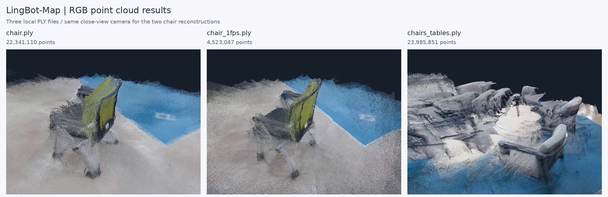
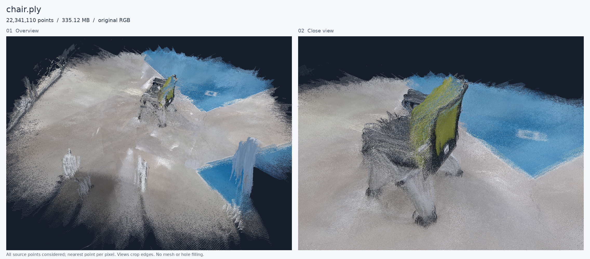
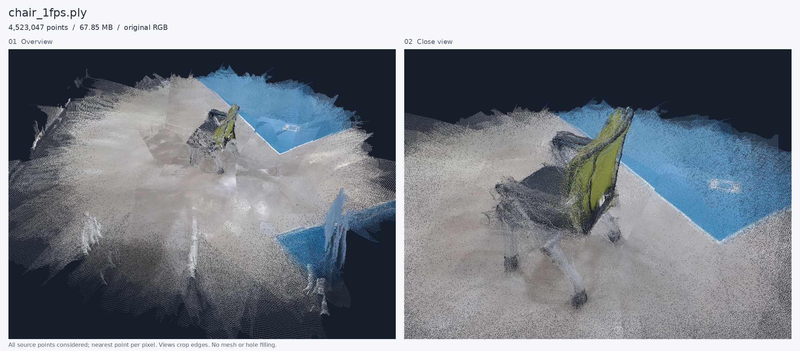
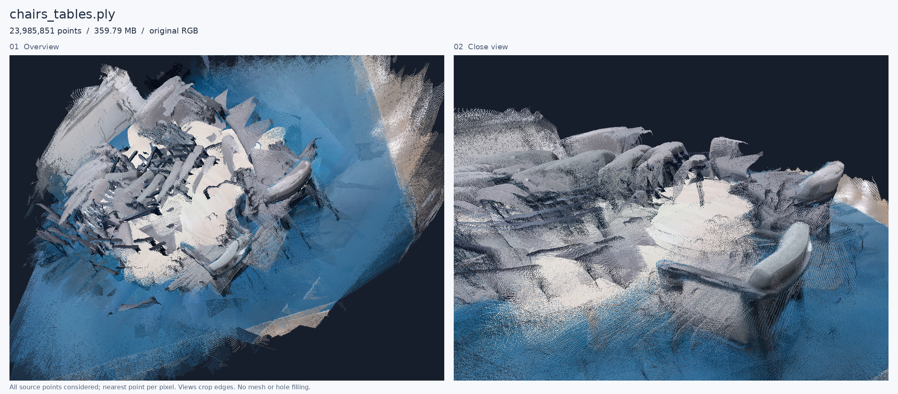
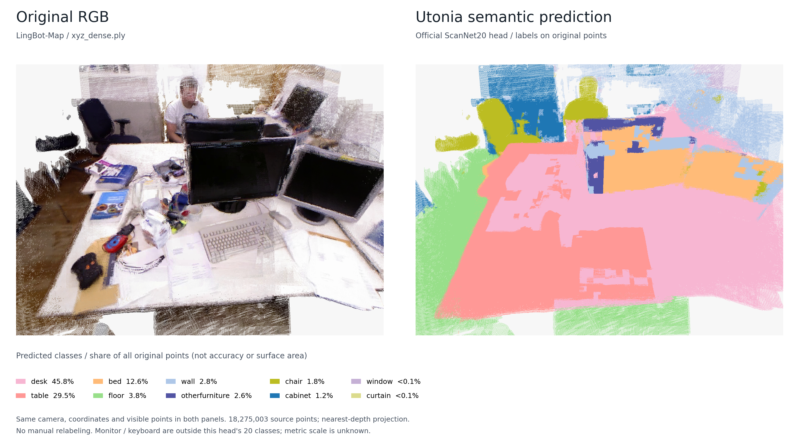
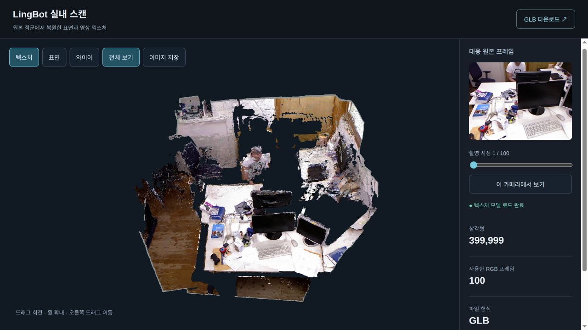

# spacewatch3d
nudix와 산학연계 협력 프로젝트입니다. by kdj

개요:
영상으로부터 카메라의 위치·자세와 장면의 깊이를 추정하여 공통 좌표계의 3D 포인트클라우드 지도를 생성한다. 
gps가 사용 가능하다면 보조 정도... gps로 카메라 방향을 알 수는 없으니깐
프레임(모든 프레임 또는 키 프레임)에 2D segmentation을 적용하고, 분할 영역의 클래스 정보를 실제로 관측된 3D 점에 주입(투영)한다. 
여러 프레임에서 관측된 동일 표면의 클래스별 분류 결과를 집계하여 최종 클래스를 결정한다. 관측이 부족하거나 결과가 충돌하는 영역은 미확정으로 관리하고, 관측 시각과 근거 프레임을 연결해 저장한다.
이후 3D point를 객체 단위로 다루어야 하는데, 객체로 만드는 과정에서 segmentation 결과를 사용할지 아니면 3D point에서 객체로 묶고 segmentation을 사용할지 고민되는 부분이다.
초기에는 천장·벽·바닥·의자처럼 고정된 클래스 집합을 사용한다. 이후에는 대표 프레임에서 VLM으로 클래스 후보를 추출하고, 이름을 표준화한 공통 클래스 목록을 텍스트 기반 segmentation에 활용하여 확장한다.
초기에는 rgb 영상으로 진행하고 추후에 360도 카메라로 확장할 수 있도록 설계한다.

사용할 라이브러리:

~~COLMAP + (PyCOLMAP) + Open3D~~
LingBot-Map 으로 3D 맵 생성
퀄리티가 끝내줌. transformer 사용.
영상 프레임 추출에는 FFmpeg나 OpenCV를 사용.
나중에 360도로 확장은 파노라마를 여러 방향의 일반 시야각 영상으로 변환하는 방식을 사용

lingbot-map colab 링크:
https://colab.research.google.com/drive/1h7Vo1Cgmra4qGms4jqxdCzluD7VNKOLG?usp=sharing

누구든 테스트 가능

## LingBot-Map PLY 3종 시각화

`/home/kdj/Desktop/capstone/`의 `chair.ply`, `chair_1fps.ply`, `chairs_tables.ply`를 원본 RGB로 시각화했다. **실제 PLY의 XYZ 좌표와 RGB를 투영한 결과**이며, 각 파일의 전체 모습과 가까이 본 모습을 함께 저장했다.



| 원본 파일 — 저장소 옆 폴더 | 전체 점 개수 | 파일 크기 | 장면 |
| --- | ---: | ---: | --- |
| `../chair.ply` | **22,341,110** | 335.12 MB | 녹색 등받이의 의자와 주변 바닥 |
| `../chair_1fps.ply` | **4,523,047** | 67.85 MB | 의자 장면의 별도 재구성 결과 |
| `../chairs_tables.ply` | **23,985,851** | 359.79 MB | 여러 의자·테이블과 파란 바닥 |

점 개수는 PLY 헤더와 실제 파일 길이를 대조해 확인했으며, MB는 1,000,000바이트 기준이다. 세 파일은 모두 `binary_little_endian` 형식으로, 점마다 float32 XYZ와 uint8 RGB를 저장한다. `chair_1fps.ply`의 점 개수는 `chair.ply`의 약 **20.25%**다. 점 개수 자체가 재구성 정확도를 뜻하지는 않는다.

### 파일별 전체·근접 시점

각 이미지는 왼쪽에 전체 모습을 넓게 본 시점, 오른쪽에 가까이 본 시점을 배치했다. 아래 항목을 펼치면 큰 이미지를 확인할 수 있다.

<details>
<summary><strong>chair.ply — 22,341,110점</strong></summary>



</details>

<details>
<summary><strong>chair_1fps.ply — 4,523,047점</strong></summary>



</details>

<details>
<summary><strong>chairs_tables.ply — 23,985,851점</strong></summary>



</details>

### 시각화 방법

- 최종 렌더링에는 **원본의 모든 유한한 좌표를 가진 점**을 사용했다. 카메라의 구도를 정할 때만 일부 점을 샘플링했다.
- CPU에서 원근 투영하고, 각 픽셀에 가장 가까운 점의 RGB를 표시했다. 개별 이미지의 각 시점은 **1100×825픽셀**이며, 위 비교 이미지는 이를 축소해 배치했다.
- 두 의자 파일의 좌표를 그대로 두고, 전체·근접 시점 각각에 **동일한 카메라 위치·방향·투영 범위**를 적용했다.
- 화면 구도에 따라 가장자리나 카메라 뒤쪽 점은 이미지에 나타나지 않는다. 짙은 배경은 해당 시점에서 점이 표시되지 않은 부분이다. 원본 PLY를 수정하거나 메시 생성·구멍 메우기·색 보정을 적용하지 않았다.

원본 파일의 SHA-256, 전체 점 개수, 좌표 범위, 카메라 설정과 표시된 픽셀 수는 [시각화 기록 JSON](docs/experiments/lingbot-three-ply-visualization.json)에 저장했다. 생성 전후 SHA-256을 비교해 원본 파일이 유지된 것을 확인했다.

재생성 코드: [render_lingbot_ply_previews.py](scripts/render_lingbot_ply_previews.py). NumPy와 Pillow가 설치된 환경에서 저장소 루트 기준으로 실행한다.

```bash
OPENBLAS_NUM_THREADS=4 python3 scripts/render_lingbot_ply_previews.py --source-dir /home/kdj/Desktop/capstone
```

## xyz_dense와 Utonia 분할 결과 비교

LingBot-Map으로 생성한 실내 RGB 포인트 클라우드 `xyz_dense.ply`에 **Utonia 백본 + 공식 ScanNet 20종 선형 분류 헤드**를 적용했다. 추가 학습이나 수동 라벨 수정 없이, 3D 점에 직접 semantic segmentation을 수행한 실험이다. 위에서 구상한 2D segmentation 결과의 3D 투영 방식과 비교할 수 있는 기초 실험으로 정리한다.

**책상·테이블·바닥 같은 큰 영역에 의미 라벨을 부여할 수 있었지만, 모니터를 침대로 분류하는 등 오류가 있어 세부 객체 구분에 그대로 사용하기는 어렵다.** Utonia 적용은 기존 형상을 개선하거나 새 지도를 만드는 과정이 아니라, 재구성된 점에 클래스를 예측해 추가하는 과정이다.

### 같은 시점에서 본 원본과 예측



왼쪽은 원본 RGB, 오른쪽은 예측 클래스 색상이다. 원본 전체 **18,275,003점**을 동일한 카메라로 투영하고, 각 픽셀에서 가장 가까운 점을 두 그림에 똑같이 사용했다. 비교용 그림은 화면 밖 가장자리 일부를 잘랐으며, PLY에서 점을 삭제한 것은 아니다. 오른쪽과 색칠 PLY는 공식 ScanNet 팔레트를 사용한다.

| 비교 항목 | 원본 `xyz_dense.ply` | Utonia 적용 결과 |
| --- | --- | --- |
| 담긴 정보 | XYZ 좌표 + 실제 RGB | 기존 정보 + 예측 클래스·confidence |
| 형상·좌표계 | LingBot-Map 재구성 결과 | 전체 라벨 PLY에서 원본 좌표·점 순서 그대로 유지 |
| 색상의 의미 | 물체 표면의 실제 색 | 전체 라벨 PLY는 실제 RGB 유지, 색칠 PLY는 클래스별 색 |
| 의미 분류 | 없음 | ScanNet 20종 중 하나를 각 점에 할당 |
| 객체 구분 | 색과 형상을 사람이 해석 | 클래스 구분만 수행하며, 같은 종류의 개별 객체 ID는 없음 |
| 주요 용도 | 재구성 형상·외관 확인 | 장면의 의미 영역과 오분류 검토 |

### 관찰된 결과와 한계

- 책상 표면의 상당 부분이 `desk` 또는 `table`로, 왼쪽 바닥과 의자 일부가 각각 `floor`, `chair`로 예측됐다. 큰 영역을 나누는 가능성은 확인했다.
- 하나로 보이는 책상 표면에서도 `desk`와 `table`이 섞인다. 이를 서로 다른 실제 객체가 검출된 것으로 해석하면 안 된다.
- 중앙·오른쪽 모니터 영역의 상당 부분이 `bed`로 잘못 분류됐다. 뒤쪽 사람도 `chair`로 분류되는 오류가 보인다. **사용한 20종 헤드에는 모니터·키보드·사람 클래스가 없다.** 해당 물체도 학습된 클래스 중 하나로 강제 분류된다.
- 키보드·책 등 작은 물체의 경계는 주변 책상 영역에 섞인다. 입력 점을 줄이는 voxel 처리와 라벨을 원본으로 옮기는 과정도 작은 경계를 거칠게 만들 수 있다.
- LingBot-Map 좌표의 실제 단위를 모른다. 미터 단위로 보정하지 않았고, 위쪽 방향과 법선도 형상으로 추정했다. 따라서 학습 데이터와의 크기·방향·법선 차이가 예측에 영향을 줄 수 있다.
- 정답 라벨이 없어 **정확도·mIoU는 측정하지 않았다.** `confidence`는 최대 softmax 값이며, 실제 정답 확률이나 검증된 정확도가 아니다.

### 클래스별 예측 분포

아래 비율은 라벨을 연결한 **원본 전체 점 개수** 기준이다. 면적·물체 개수·정확도와는 다르며, 원본 점의 밀도에 영향을 받는다. `bed` 비율도 침대가 실제로 존재한다는 뜻이 아니다.

| 예측 클래스 | 점 개수 | 전체 점 대비 비율 |
| --- | ---: | ---: |
| 책상 `desk` | 8,363,091 | 45.76% |
| 테이블 `table` | 5,388,772 | 29.49% |
| 침대 `bed` | 2,297,665 | 12.57% |
| 바닥 `floor` | 698,127 | 3.82% |
| 벽 `wall` | 505,106 | 2.76% |
| 기타 가구 `otherfurniture` | 470,396 | 2.57% |
| 의자 `chair` | 323,378 | 1.77% |
| 수납장 `cabinet` | 216,791 | 1.19% |
| 창문 `window` | 11,604 | 0.06% |
| 커튼 `curtain` | 73 | <0.01% |
| **합계** | **18,275,003** | **100%** |

나머지 10개 클래스는 예측된 점이 없다. 비율은 반올림했으며, 전체 클래스 ID·색상·집계와 전처리 설정은 [실험 기록 JSON](docs/experiments/xyz-dense-utonia.json)에 저장했다.

### 처리 방법과 산출물

```text
원본 XYZ + RGB: 18,275,003점
  → 0.0075 좌표 단위 voxel 평균: 620,660개 대표점
  → 지배적인 평면으로 위쪽 방향 추정, 30개 이웃의 PCA로 법선 추정
  → Utonia 입력 변환(scale=0.5, grid=0.01): 63,220점
  → Utonia 특징 추출 + ScanNet20 선형 분류
  → voxel 역매핑으로 원본 18,275,003점에 클래스·confidence 연결
```

18,275,003점을 모두 독립적으로 추론한 것은 아니다. 대표점의 예측을 같은 voxel의 원본 점들에 연결했다. 위 크기 값은 **재구성 좌표 단위**이며, cm 또는 m로 해석하지 않는다.

| 로컬 파일 | 점 개수 | 저장 내용 | 크기(약) |
| --- | ---: | --- | ---: |
| `lingbot_result/xyz_dense.ply` | 18,275,003 | 원본 XYZ + RGB | 274 MB |
| `lingbot_result/utonia/xyz_dense_utonia_labeled.ply` | 18,275,003 | 원본 XYZ + RGB + `semantic_label` + `confidence` | 366 MB |
| `lingbot_result/utonia/xyz_dense_utonia_colored.ply` | 620,660 | 대표점 좌표 + 클래스 색상 + 라벨·confidence | 12.4 MB |

`semantic_label`은 0~19 내부 인덱스가 아니라 **ScanNet/NYU40 클래스 ID**다. 예를 들어 `desk=14`, `table=7`, `bed=4`다. 전체 라벨 PLY의 좌표·RGB·점 순서가 원본과 정확히 일치하고, 클래스별 점 수의 합이 전체 점 수와 일치하는 것을 확인했다. 대용량 PLY는 기존 `.gitignore`의 `lingbot_result/`에 보관하며, README의 비교 이미지와 실험 기록은 저장소에 포함한다.

실행은 로컬 CPU에서 진행했다. 공식 가중치를 유지한 채 attention을 PyTorch SDPA로, 희소 합성곱을 gather/matmul/scatter 계산으로 실행했다. 작은 입력에서 기준 연산과 비교한 최대 절대 오차는 각각 `8.94e-8`, `1.79e-7`이었다. 전체 모델의 GPU 결과와 일치하는지까지 검증한 것은 아니다.

- 공식 코드: [Pointcept/Utonia](https://github.com/Pointcept/Utonia), 사용 커밋 `da776a0bd3a48c6df83ac2ae0e27b26141cc7e31`
- 공식 가중치: [Hugging Face · Pointcept/Utonia](https://huggingface.co/Pointcept/Utonia), `utonia.pth` + `utonia_linear_prob_head_sc.pth`

### SpaceWatch3D에 적용할 때

이번 결과는 3D 지도에 의미 라벨을 부여하는 기초 비교 자료로 사용할 수 있다. 다만 모니터·키보드·사람까지 구분하려면 필요한 클래스가 포함된 모델이나 추가 학습, 또는 앞서 구상한 2D 분할 결과의 3D 투영 방식을 비교해야 한다. 다음 실험에서는 같은 영역에 정답 라벨을 만들고, 클래스별 IoU와 작은 물체의 경계 품질을 평가한다. 개별 객체 추적에는 semantic segmentation 이후의 객체 묶음 처리와 객체 ID 관리가 별도로 필요하다.

## LingBot-Map 점군을 텍스처가 있는 GLB로 변환

LingBot-Map의 `dense.ply`, `cameras.npz`, `run_info.json`과 원본 RGB 영상을 이용해 **Open3D로 표면 메시를 만들고, OpenMVS로 영상 텍스처를 입힌 GLB 파일**을 생성했다. 점으로 표시하던 장면을 삼각형 면과 UV 텍스처로 표현하므로 Blender나 GLB 지원 3D 뷰어에서 모델 파일로 사용할 수 있다.

### 변환 결과



왼쪽은 완성된 GLB를 전체 시점에서 본 모습이고, 오른쪽은 원본 영상의 첫 번째 사용 프레임이다. 두 화면은 서로 다른 시점이며, 뷰어의 **이 카메라에서 보기**를 누르면 선택한 원본 프레임의 촬영 위치·방향으로 모델을 확인할 수 있다. 빈 부분은 배경이 보이는 구멍으로, 촬영되지 않았거나 표면 복원이 충분하지 않은 영역이다.

| 항목 | 결과 |
| --- | --- |
| 입력 압축파일 | `result_65c313.zip` — 점군·카메라·실행 기록 포함 |
| 원본 영상 | `rgbd_dataset_freiburg1_xyz-rgb.avi` |
| 입력 점 개수 | 18,275,003점 |
| 사용한 영상 구간 | 0~19.8초, 6프레임 간격으로 총 100프레임 |
| 카메라·영상 해상도 | 프레임별 카메라 100개, 전처리된 RGB 518×392 |
| 표면 복원 | Open3D TSDF 융합 → 작은 조각 제거 → 메시 단순화 |
| 삼각형 개수 | 융합 직후 2,380,903개 → 최종 **399,999개** |
| 텍스처 생성 | OpenMVS `TextureMesh` v2.4.0 |
| 텍스처 이미지 | **2048×2048 PNG 1개**, GLB 내부에 포함 |
| 최종 파일 | `lingbot_textured.glb`, **20,076,284바이트(약 20.1 MB)** |
| 좌표 단위 | LingBot-Map 재구성 단위, 실측 미터로 보정하지 않음 |

### 처리 과정과 cameras.npz의 역할

```text
dense.ply + run_info.json의 프레임별 점 개수
  → 각 점을 생성한 프레임 구간 복원
  → cameras.npz의 C2W·내부 파라미터로 원래 픽셀에 재투영
  → 필터링 후 남은 유효 깊이 샘플 복원

원본 RGB 영상 + cameras.npz의 source_frame_index
  → 대응하는 100프레임 추출
  → 기존 LingBot 입력과 동일한 JPEG·리사이즈 전처리

유효 깊이 + RGB + 카메라
  → Open3D TSDF 융합 → 약 40만 면으로 단순화
  → 카메라를 COLMAP 형식으로 변환 → InterfaceCOLMAP으로 scene.mvs 생성
  → OpenMVS TextureMesh로 UV·텍스처 생성
  → 텍스처 PNG를 GLB 안에 포함 → 단일 GLB 파일 검증
```

`c2w`는 각 프레임의 카메라 위치·방향, `intrinsic`은 픽셀 투영에 필요한 내부 파라미터다. `source_frame_index`는 원본 영상에서 사용할 프레임을 지정하고, `image_hw`는 내부 파라미터가 적용되는 이미지 크기를 알려준다. COLMAP/OpenMVS에 연결할 때는 C2W를 W2C로 역변환했으며, 각 프레임의 내부 파라미터를 별도로 유지했다.

이번 압축파일에는 별도 깊이맵이 없지만, PLY 점 순서와 `run_info.json`의 `points_per_frame`이 보존되어 있어 **원래 프레임에서 유지된 약 90%의 픽셀 깊이**를 복원할 수 있었다. 제거된 나머지 깊이는 0으로 두었다. TSDF의 voxel 크기는 `0.004`, 절단 거리는 `0.02`로 설정했으며 모두 재구성 좌표 단위다.

### 검증과 남은 한계

- 원래 픽셀로의 재투영 최대 오차는 **0.000039픽셀 미만**이었다. 추출한 영상 프레임과 PLY의 RGB를 대응 점 위치에서 비교한 평균 절대 오차는 **0**이었다. 이는 프레임·전처리·카메라 연결 검증이며, 실제 3D 형상 정확도를 측정한 값은 아니다.
- 최종 GLB의 면 인덱스·유한 좌표·UV·내장 텍스처를 확인하고, trimesh와 브라우저 GLTFLoader에서 재로딩했다. **외부 PNG 없이 GLB 파일 하나로 열 수 있다.**
- OpenMVS의 기본 경계 색상 보정에서 `std::out_of_range` 오류가 발생해 `--global-seam-leveling 0 --local-seam-leveling 0`으로 처리했다. 텍스처 패치 사이에 색상 차이가 남을 수 있다.
- 가려진 면의 구멍, 깊이 추정 잡음, 얇은 물체의 변형이 남아 있다. 닫힌 CAD 솔리드나 치수가 보정된 모델로 해석하지 않는다.
- 이 GLB에는 형상과 실제 RGB 텍스처를 저장했다. Utonia의 클래스 라벨과 개별 객체 ID를 메시로 연결하는 작업은 후속 단계다.

상세 수치와 GLB SHA-256은 [변환 실험 기록 JSON](docs/experiments/lingbot-open3d-openmvs-glb.json)에 저장했다. README의 결과 사진과 실험 기록은 저장소에 포함하며, 대용량 모델과 중간 산출물은 저장소 옆의 로컬 `../lingbot_textured_model/` 폴더에 보관한다.

| 로컬 산출물 위치 — 저장소 루트 기준 | 내용 |
| --- | --- |
| `../lingbot_textured_model/lingbot_textured.glb` | 최종 모델, 텍스처 내장 |
| `../lingbot_textured_model/mesh_open3d.ply` | Open3D로 생성한 중간 메시 |
| `../lingbot_textured_model/colmap/` | 대응 RGB 이미지와 변환한 카메라 정보 |
| `../lingbot_textured_model/scripts/` | 메시 생성·텍스처 내장·GLB 검증 코드 |
| `../lingbot_textured_model/README.md` | 실행 명령과 재현 방법 |

로컬 뷰어는 [3D 미리보기](http://127.0.0.1:8766/viewer/)에서 회전·확대, 표면·와이어 표시, 원본 촬영 시점 비교를 지원한다. 이 링크는 해당 PC에서 서버가 실행 중일 때만 동작한다. 서버를 다시 시작하려면 저장소 루트에서 실행한다.

```bash
python3 -m http.server 8766 --bind 127.0.0.1 --directory ../lingbot_textured_model
```

사용 도구: [Open3D](https://github.com/isl-org/Open3D), [OpenMVS](https://github.com/cdcseacave/openMVS).
