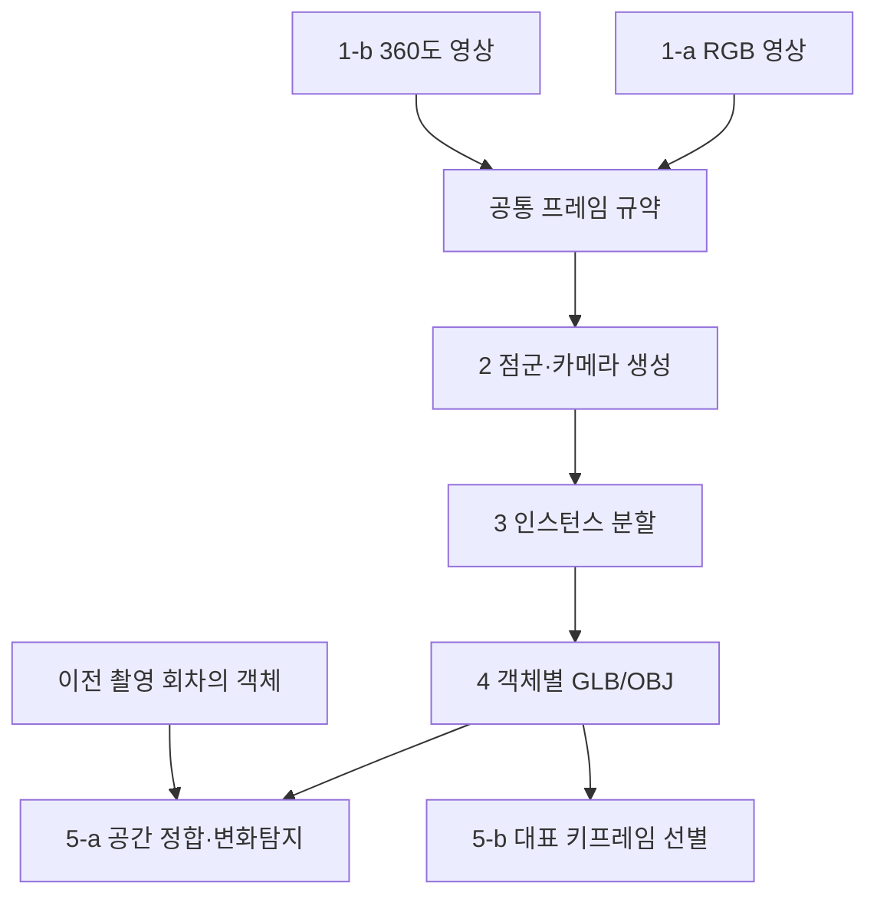

# SpaceWatch3D

영상 기반 객체별 3D 모델 생성 및 시계열 공간 변화 모니터링 프로젝트입니다.
첨부 파이프라인(2026-09-27)을 기준으로 **task별 병렬 개발을 시작할 수 있는 공통 기반**을 구성했습니다.

**현재 상태:** task 폴더, 입출력 규약, 합성 fixture, 검증 CLI가 준비되어 있습니다.
실제 영상 처리·LingBot-Map·MV3DIS·메시 생성·정합·변화탐지·키프레임 선별 backend는 각 task에서 구현합니다.
`run`은 backend 연결 전까지 미구현 오류를 반환합니다. fixture 검증 통과는 모델 성능이나 전체 파이프라인 완성을 의미하지 않습니다.


spacewatch3d/
├── README.md                  # 프로젝트 소개와 시작 방법
├── CONTRIBUTING.md            # 브랜치·PR 등 협업 규칙
├── pyproject.toml             # Python 패키지 설정과 공통 의존성
├── .gitignore                 # Git에 올리지 않을 파일 지정
│
├── src/
│   └── spacewatch3d/           # 프로젝트의 Python 코드
│       ├── __init__.py
│       ├── __main__.py         # python -m spacewatch3d 진입점
│       ├── cli.py              # 명령어 처리와 작업 실행
│       ├── task_api.py         # 모든 작업이 공유하는 입력 형식
│       ├── registry.py         # 작업 번호·모듈·입출력 연결표
│       ├── contracts.py        # 결과 파일의 규칙·참조 관계 검사
│       ├── schemas/
│       │   └── artifact.schema.json  # JSON 데이터 형식 정의
│       └── tasks/             # 단계별 알고리즘 구현 위치
│
├── examples/
│   └── fixtures/              # 개발·검증용 합성 예제
│       ├── before/            # 이전 촬영 회차 예제
│       ├── after/             # 이후 촬영 회차 예제
│       ├── panorama/          # 360도 영상 예제
│       └── changes.json       # 변화 결과 예제
│
├── tests/                     # 공통 검증 테스트
├── docs/                      # 설계 문서·작업표·발표자료
├── .github/                   # 자동 검사와 Issue·PR 양식
│
├── data/                      # 실제 입력 영상·데이터셋
├── outputs/                   # 실행 결과
├── weights/                   # AI 모델 가중치
└── third_party/               # 외부 모델 소스코드

참고해서 파일 정리할 것!!!!!!

## Task별 작업 위치

| 그림 번호 | 담당 범위 | 개발 폴더 | 입력 → 출력 |
|---|---|---|---|
| 1-a | RGB 영상 입력·프레임 추출 | [task_1a_rgb_input](src/spacewatch3d/tasks/task_1a_rgb_input/) | 일반 영상 → 프레임·출처 정보 |
| 1-b | 360° 영상의 perspective view 변환 | [task_1b_360_input](src/spacewatch3d/tasks/task_1b_360_input/) | 360° 영상 → 프레임·가상 카메라 정보 |
| 2 | 포인트클라우드 생성, LingBot-Map adapter | [task_2_reconstruction](src/spacewatch3d/tasks/task_2_reconstruction/) | 프레임 → XYZRGB·카메라·깊이 |
| 3 | 3D 인스턴스 분할, MV3DIS adapter | [task_3_instance_segmentation](src/spacewatch3d/tasks/task_3_instance_segmentation/) | 재구성 결과 → 점별 객체 ID·객체 메타데이터 |
| 4 | 객체별 메시·색상·텍스처 저장 | [task_4_object_export](src/spacewatch3d/tasks/task_4_object_export/) | 인스턴스 → GLB/OBJ·객체 메타데이터 |
| 5-a | 회차 간 **공간 정합 + 객체 대응 + 변화탐지** | [task_5a_change_detection](src/spacewatch3d/tasks/task_5a_change_detection/) | 두 회차의 객체 → 정합 변환·변화 결과 |
| 5-b | 객체별 대표 키프레임 **선별** | [task_5b_keyframes](src/spacewatch3d/tasks/task_5b_keyframes/) | 객체·관측 정보 → 원본 프레임·시각 |

각 폴더에 `README.md`, `pipeline.py`, `config.example.json`, `requirements.txt`가 있습니다.
사람별 담당 배정은 아직 지정하지 않았습니다. 같은 사람이 관련 task를 함께 맡아도 폴더와 출력 규약은 유지합니다.


```mermaid
flowchart TD
    A["1-a RGB 영상"] --> C["공통 프레임 규약"]
    B["1-b 360도 영상"] --> C
    C --> D["2 점군·카메라 생성"]
    D --> E["3 인스턴스 분할"]
    E --> F["4 객체별 GLB/OBJ"]
    F --> G["5-a 공간 정합·변화탐지"]
    F --> H["5-b 대표 키프레임 선별"]
    P["이전 촬영 회차의 객체"] --> G
```

실제 데이터 처리는 이 의존 순서가 필요합니다. **개발은 제공된 task별 입력 fixture로 동시에 진행**합니다.
5-a와 5-b는 서로의 구현을 기다릴 필요가 없습니다. 각 manifest는 상위 결과를 참조하므로 프레임·카메라 정보도 추적할 수 있습니다.

## 5분 시작

Python 3.10+가 필요합니다. 아래 명령은 저장소 루트에서 실행합니다.

```bash
git clone --depth 1 --single-branch --branch main https://github.com/choonpal/spacewatch3d.git
cd spacewatch3d
python -m venv .venv
```

Linux/macOS: `source .venv/bin/activate` · Windows PowerShell: `.venv\Scripts\Activate.ps1`

```bash
python -m pip install -e .
python -m spacewatch3d tasks
python -m spacewatch3d check-fixtures
python -m unittest discover -s tests -v
```

공통 환경은 jsonschema만 설치하며 GPU가 필요하지 않습니다. 모델별 의존성은 해당 task 환경에 설치합니다.
작은 합성 영상은 이미 포함되어 있어 검증에 FFmpeg 설치도 필요하지 않습니다.

## 내 task만 시작하기

예를 들어 Task 3 담당자는 다음과 같이 시작합니다.

```bash
git switch -c task/3-instance-segmentation/mv3dis-adapter
python -m spacewatch3d check-fixtures --task 3
```

1. `src/spacewatch3d/tasks/task_3_instance_segmentation/README.md`를 읽습니다.
2. 입력 예제 `examples/fixtures/before/reconstruction.json`과 출력 예제 `instances.json`을 확인합니다.
3. 해당 폴더의 `pipeline.py`에 `run(request) -> Path`를 구현합니다.
4. 출력 manifest를 검증하고 task 전용 테스트와 재현 명령을 추가합니다.
5. 작업 브랜치를 push하고 `main` 대상 PR로 통합합니다.

```bash
python -m spacewatch3d validate outputs/my-run/instances.json --check-files
git add src/spacewatch3d/tasks/task_3_instance_segmentation tests/task_3_instance_segmentation
git commit -m "feat(task-3): add MV3DIS adapter"
git push -u origin task/3-instance-segmentation/mv3dis-adapter
```

팀원의 기존 작업물을 그대로 덮어쓰지 않도록 [협업 절차](CONTRIBUTING.md)를 따릅니다.
개별 GitHub issue나 담당자 알림은 자동 생성하지 않았습니다. [task 작업표](docs/task-board.md)에서 분담과 완료 기준을 확인합니다.

## 공통 영역과 데이터

| 경로 | 용도 |
|---|---|
| `src/spacewatch3d/tasks/` | task별 구현·설정·의존성 설명 |
| `src/spacewatch3d/task_api.py` | 모든 task의 공통 함수 입력 |
| `src/spacewatch3d/registry.py` | task 입력 이름·출력 kind·fixture 매핑 |
| `src/spacewatch3d/schemas/` | 기계 검증용 JSON Schema 0.1.0 |
| [docs/contracts.md](docs/contracts.md) | 좌표·스케일·ID·파일 경로·단계별 규약 |
| [examples/fixtures/](examples/fixtures/) | 작은 합성 입력·출력: 앞 task 없이 개발 시작 |
| `tests/` | 공통 규약 검증 및 task별 테스트 위치 |
| `data/`, `outputs/`, `weights/`, `third_party/` | 실제 데이터·실행 결과·가중치·외부 코드, Git 제외 |
| `.github/` | PR·task issue 양식과 CPU 규약 검사 CI |

공통 규약을 변경할 때는 schema·문서·fixture·테스트를 함께 갱신하고 영향을 받는 task 담당자와 합의합니다.
점군을 곧바로 메시로 간주하거나, 분할 모델이 의미 클래스까지 반드시 제공한다고 가정하지 않습니다.

## 기존 작업과 기록

- [이전 main README 원문](docs/history/README-before-task-layout.md): COLMAP/OpenMVS 실험 기록. 원문 내 산출물 경로는 당시 작업 환경 기준입니다.
- 기존 `docs/`의 수행계획서·발표자료는 유지했습니다. 현재 task 구분과 입출력은 이 README 및 `docs/contracts.md`를 기준으로 합니다.
- `kdj`, `lth`, `gwanwoo3849-for-commit`, `wooh594-for-commit`, `library-cleanup` 브랜치와 기존 PR은 그대로 유지합니다.
- 기존 코드를 가져오는 위치와 절차: [기존 브랜치 이관 가이드](docs/migration.md).

현재 요청의 범위는 그림에 해당하는 분석 파이프라인의 병렬 개발 기반입니다. 기존 웹 초안은 별도 브랜치에 보존되어 있습니다.
