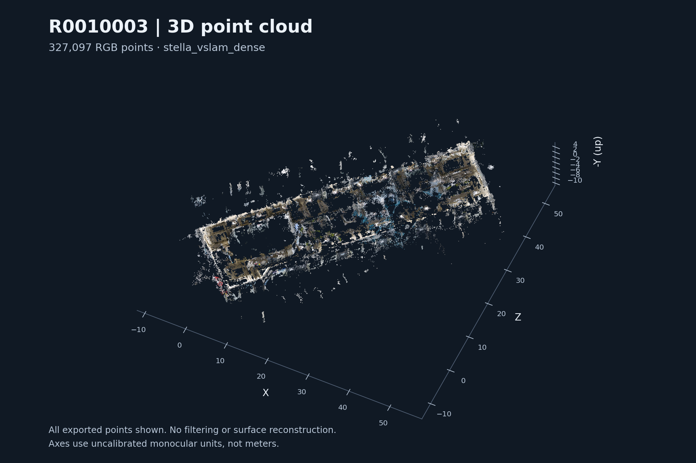
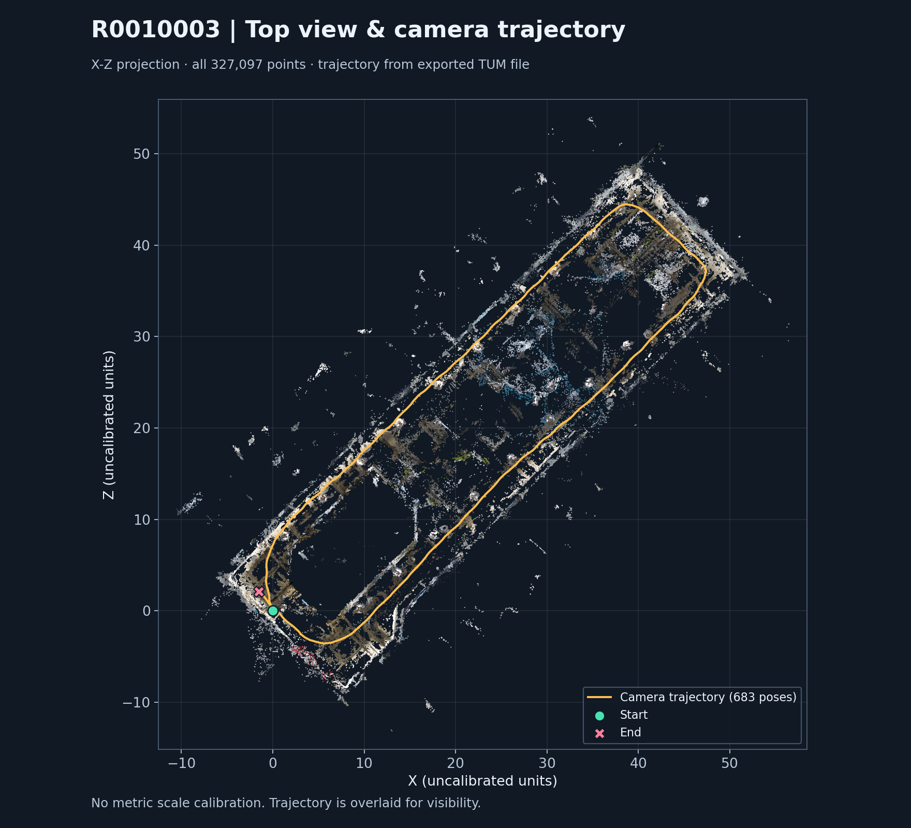
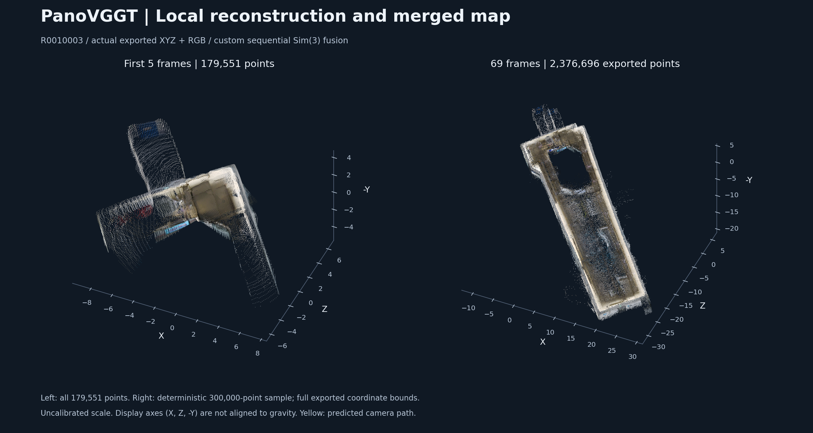
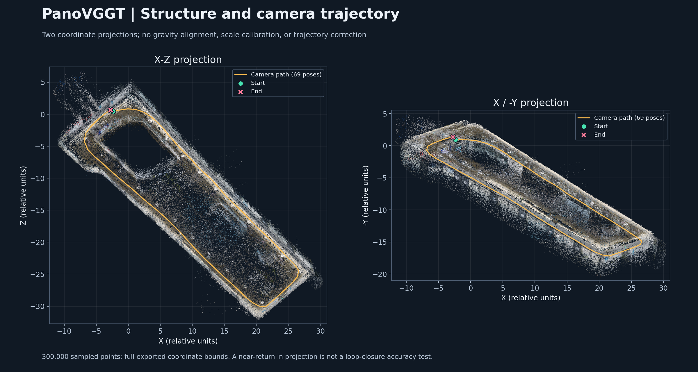
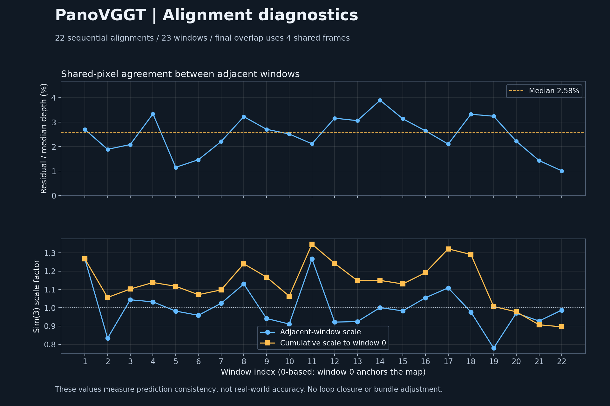

# Task 1b · 360° 영상 입력

Equirectangular 영상을 여러 perspective view로 변환한다. Task 1a와 같은 frames 규약을 출력하여 Task 2가 입력 종류에 의존하지 않도록 한다.

상태: **개발 scaffold**. 실제 backend는 아직 연결되지 않았으며 `run`은 명시적으로 미구현 오류를 반환한다. 담당자 배정은 팀에서 정한다.

## 작업 범위

- 이 디렉터리의 `pipeline.py`, backend 모듈, 설정, 의존성 설명을 수정한다.
- task 전용 테스트는 `tests/task_1b_360_input/`에 추가한다.
- 공통 규약 변경은 별도 PR에서 소비 task와 합의한다.
- 브랜치 예: `task/1b-360_input/my-feature`.

## 입력과 출력

| 입력 이름 | artifact kind | 독립 개발용 입력 |
|---|---|---|
| `video` | `video` | `examples/fixtures/panorama/video.json` |

출력 kind: `frames`. 완성된 형태의 **합성 예제**: [`panorama/frames.json`](../../../../examples/fixtures/panorama/frames.json).
공통 규약: [docs/contracts.md](../../../../docs/contracts.md).

## 바로 확인

저장소 루트에서 가상환경을 활성화하고 `python -m pip install -e .`를 먼저 실행한다.

```bash
python -m spacewatch3d check-fixtures --task 1b
```

위 명령은 파일·ID·규약만 검증한다. 모델 추론이나 task 알고리즘을 실행하지 않는다.

구현을 연결한 뒤 실행할 명령:

```bash
python -m spacewatch3d run --task 1b --input video=examples/fixtures/panorama/video.json --output outputs/task-1b-trial --config src/spacewatch3d/tasks/task_1b_360_input/config.example.json
```

`run(request: TaskRequest) -> Path`를 구현하고, 출력 디렉터리를 생성한 뒤 출력 manifest 경로를 반환한다.
현재는 exit code 2의 미구현 오류가 정상이며, 결과 파일을 성공한 것처럼 만들지 않는다.

## 첫 구현 완료 기준

- [ ] 360° 원본에서 시점별 perspective image 생성
- [ ] view_id·가상 카메라 intrinsics·source_from_view_rotation 기록
- [ ] 동일 원본 프레임의 여러 뷰는 같은 source_frame_index와 timestamp_s 유지
- [ ] 자신의 결과 JSON을 `python -m spacewatch3d validate 결과.json --check-files`로 검증
- [ ] 실행 환경·모델 revision·입력·재현 명령·한계를 README에 기록
- [ ] 합성 fixture 통과와 실제 데이터 성능 평가를 구분해서 보고

## 의존성

공통 환경은 Python 3.10+와 jsonschema만 사용한다. `requirements.txt`는 task 담당자가 검증한 의존성을 기록하는 자리다.
모델별 Python/CUDA 충돌이 있으면 task별 가상환경을 사용해 manifest와 파일로 연결한다.
외부 코드는 `third_party/`, 가중치는 `weights/`, 실제 입력은 `data/`에 두며 Git에 포함하지 않는다.

---

## 실제 360° 영상의 3D map 생성 결과 (2026-10-06)

RICOH THETA X로 촬영한 `R0010003.MP4`를 Colab에서 `stella_vslam_dense`로 처리해 **RGB 포인트 327,097개의 3D point cloud**를 생성했다. 원본 파노라마를 equirectangular 카메라 모델로 직접 입력한 실험이다.

이 결과는 별도로 실행한 Colab 실험 기록이다. 위에서 정의한 Task 1b의 perspective view 생성, `frames` manifest 출력 및 `pipeline.py` backend 연결을 완료했다는 의미는 아니다.

### 입력 및 복원 설정

| 항목 | 값 |
|---|---|
| 카메라 | RICOH THETA X — 원본 MP4 메타데이터에서 확인 |
| 입력 영상 | `R0010003.MP4`, H.264, 3840 × 1920, 2:1 equirectangular |
| 길이 / 원본 프레임 수 | 컨테이너 기준 약 68.549초 / 영상 스트림 2,055프레임 |
| 원본 평균 프레임률 | 약 30.0048 fps |
| 복원 프로그램 | `stella_vslam_dense`, revision `8f91e7eb01eadca72b21984642e88bf877598ace` |
| 실행 방식 | Colab의 별도 Python 3.12 가상환경에서 headless 실행 |
| 추적 해상도 | 1920 × 960 |
| 깊이 계산 해상도 | 640 × 320 |
| 입력 간격 | `--frame-step 3`, 약 10 fps에 해당하는 간격으로 총 685프레임 처리 |
| 촬영자 제외 마스크 | 영상 하단 35% 제외 (`mask_start=0.65`), 파노라마 자체는 자르지 않음 |
| 주요 옵션 | dense reconstruction 및 loop detection 활성화, `--auto-term`, `--wait-loop-ba` |

설정 근거는 결과 폴더의 `input_metadata.json`, `run_settings.json`, `theta_x.yaml`, `operator_mask.png`다. 하단 마스크는 촬영자뿐 아니라 해당 영역의 바닥 정보도 제외한다.

### 생성 결과와 실행 기록

| 항목 | 확인 결과 |
|---|---|
| Dense point cloud | `dense.ply`, ASCII PLY, XYZ + RGB, **327,097개 점** |
| PLY 파일 크기 | 13,145,099 bytes, 약 13.15 MB |
| SLAM map database | `map.db`, 254,324,736 bytes, 약 254.32 MB |
| 프레임 처리 | **685 / 685** 완료, 로그의 `End of video.` 확인 |
| 저장된 카메라 pose | TUM 형식 683개; 로그에 내부 frame 1~2의 trajectory 누락 경고가 기록됨 |
| 저장된 키프레임 | 97개, keyframe ID 0~96 |
| 루프 폐쇄 | keyframe **2 ↔ 95** 검출, loop bundle adjustment 완료 |
| 복원 소요 시간 | 로그 첫 설정 로드부터 마지막 map 정리까지 **203.38초, 약 3분 23초** |
| 데이터 검사 | 실제 PLY 행 수와 요약값 일치, 모든 XYZ 유한값, RGB 0~255 범위 확인 |

소요 시간에는 SLAM 처리, 종료 및 결과 저장이 포함되며 설치·컴파일·영상 업로드 시간은 포함되지 않는다. `summary.json`과 실제 PLY, `reconstruction.log`, ZIP 내부 trajectory 파일을 함께 확인한 수치다.

### 결과 이미지

아래 이미지는 결과 `dense.ply`를 직접 렌더링했다. **327,097개 점을 모두 사용**했으며, 시각화를 위한 다운샘플링·이상점 제거·메시 생성은 하지 않았다. 좌표는 저장된 `preview.html`과 같이 `(X, Z, -Y)`로 표시한다. 축 값은 미터로 보정되지 않은 단안 복원 좌표다.

**3D 전체 보기**



길게 이어진 공간의 윤곽과 일부 수직 구조를 확인할 수 있다. 표면이 비어 있는 부분과 주 구조 주변에 흩어진 점도 남아 있다.

**위에서 본 point cloud와 카메라 이동 경로**



주황색 선은 ZIP에 저장된 `trajectory/frame_trajectory.txt`의 683개 카메라 위치를 시간순으로 연결한 것이다. 초록 원은 시작, 분홍 X는 끝을 나타낸다. 경로는 식별을 위해 point cloud 위에 겹쳐 그렸으며 시작 부근으로 돌아오는 형태가 보인다. 시작점과 끝점이 정확히 일치하지 않는 것만으로 위치 오차를 산출할 수는 없다.

### 해석과 현재 한계

- 360° 영상으로부터 dense point cloud, SLAM map 및 카메라 경로를 생성하고 루프 최적화까지 수행했다.
- 전체적인 공간 구조는 시각적으로 확인되지만, 빈 영역과 흩어진 점이 있어 완전한 표면 복원이나 정밀 도면으로 간주하지 않는다.
- 단안 복원이므로 절대 스케일은 미보정 상태다. 길이·면적을 미터 단위로 사용하려면 실측 기준 길이를 이용한 스케일 보정이 필요하다.
- Ground truth 또는 실측과의 정합·오차 평가는 수행하지 않았다. 유효한 점이 생성되고 루프 폐쇄가 완료됐다는 사실만으로 기하 정확도가 검증되지는 않는다.
- 물체 instance segmentation, 객체별 export, 변화 감지 및 프로젝트 공통 artifact 규약 연결은 이 실험에서 수행하지 않았다.

### 원본 산출물 위치 및 다시 확인하는 방법

입력과 결과는 로컬에 다음과 같이 보관되어 있다.

```text
입력: /home/kdj/Desktop/capstone/360video/R0010003.MP4
결과: /home/kdj/Desktop/capstone/360video/R0010003 zip/
```

| 파일 | 용도 |
|---|---|
| `dense.ply` | RGB point cloud 원본, CloudCompare 또는 MeshLab 등으로 확인 |
| `map.db` | Stella SLAM map database |
| `preview.html` | 회전 가능한 Plotly 미리보기; 노트북 코드상 최대 50,000개 점 표시 |
| `summary.json` | 점 개수, 파일 크기, 좌표 범위, 스케일 안내 |
| `run_settings.json`, `theta_x.yaml` | 실행 명령, revision 및 복원 설정 |
| `input_metadata.json`, `operator_mask.png` | 원본 영상 메타데이터 및 마스크 |
| `reconstruction.log` | 초기화, 처리 진행, 루프 최적화, 저장 기록 |
| `R0010003_20261006_133052_202712.zip` | 위 결과와 `trajectory/`를 포함하는 전체 묶음 |

현재 결과 폴더에서는 `trajectory/`가 별도로 풀려 있지 않으며, ZIP 안에 `frame_trajectory.txt`, `keyframe_trajectory.txt`, `tracking_times.txt`가 들어 있다. 원본 MP4·PLY·DB·ZIP은 이 README에 복사하지 않고, 아래 PNG와 이미지 재생성 스크립트만 문서 자산으로 추가했다.

복원에 사용한 [Colab 노트북](https://colab.research.google.com/drive/1Ok7v3GdK-oeHMj4mz4iL1OQeZLQaQw2G?usp=sharing)에서 설치·설정 후 실행한 명령은 다음과 같다. 입력·vocabulary·설정·마스크가 존재하고 필요한 라이브러리가 설치된 Colab 환경을 전제로 한다.

```bash
export PYTHONPATH=/content/stella_vslam_dense_8f91e7e/build/lib
export LD_LIBRARY_PATH="/usr/local/lib:${LD_LIBRARY_PATH:-}"
export OMP_NUM_THREADS=2
RESULT_DIR="$(mktemp -d /content/stella_theta/R0010003_replay_XXXXXX)"
mkdir -p "$RESULT_DIR/trajectory"

/content/stella-venv312/bin/python -u \
  /content/stella_vslam_dense_8f91e7e/tools/run_video_slam.py \
  -v /content/stella_theta/orb_vocab.fbow \
  -c /content/stella_theta/theta_x.yaml \
  -m /content/R0010003.MP4 \
  --mask /content/stella_theta/operator_mask.png \
  --frame-step 3 --disable-viewer --auto-term --wait-loop-ba \
  -o "$RESULT_DIR/map.db" -p "$RESULT_DIR/dense.ply" \
  --eval-log-dir "$RESULT_DIR/trajectory"
```

출력 경로는 재실행 시 기존 결과를 덮어쓰지 않도록 새 폴더로 바꿨다. 설치 노트북에는 Python 3.12 가상환경 지정, CUDA 13에서 제거된 GPU 진단 필드에 대한 조건부 컴파일, OpenCV `imgcodecs` 링크 보완이 반영되어 있다.

README 이미지의 재생성 스크립트는 [`assets/r0010003_20261006/render_results.py`](assets/r0010003_20261006/render_results.py)다. 저장소 루트에서 NumPy와 Matplotlib이 설치된 환경으로 실행한다. 원본 PLY는 읽기만 하며, trajectory는 압축을 풀지 않고 ZIP에서 읽을 수도 있다.

```bash
python3 -s src/spacewatch3d/tasks/task_1b_360_input/assets/r0010003_20261006/render_results.py \
  '/home/kdj/Desktop/capstone/360video/R0010003 zip'
```

이미지는 로컬 Python의 NumPy 1.x / Matplotlib 3.5.1 조합으로 생성했다. 위 `-s`는 이 PC의 사용자 설치 NumPy와 시스템 Matplotlib 간 충돌을 피하기 위해 사용자 site-packages를 제외하는 옵션이다.

---

## PanoVGGT 복원 결과 (2026-10-07)

같은 `R0010003.MP4`에서 약 1초 간격으로 추출한 **360° 파노라마 69장**을 PanoVGGT로 처리했다. 5장씩 복원한 23개 묶음을 별도의 정합 코드로 연결해 **RGB 포인트 2,376,696개의 통합 point cloud와 카메라 pose 69개**를 저장했다.

공식 PanoVGGT 모델의 다중 이미지 예측에 **공통 프레임 기반의 순차 Sim(3) 정합**을 추가한 Colab 실험이다. Sim(3)는 묶음 사이의 회전·이동·크기를 함께 맞추는 변환이다. 이번 처리에는 loop closure와 bundle adjustment를 적용하지 않았다. Task 1b의 `pipeline.py` 및 공통 `frames` 규약과는 아직 연결하지 않았다.

### 입력과 실행 설정

| 항목 | 값 |
|---|---|
| 원본 | RICOH THETA X의 `R0010003.MP4`, 3840 × 1920, 2,055프레임 |
| 프레임 선택 | 원본 30프레임마다 1장, 총 69장; 원본 frame index 0~2,040 |
| 선택 프레임의 시간 범위 | 0.000000~67.989067초 |
| 모델 입력 | 2:1 equirectangular RGB 이미지, **1036 × 518**; perspective 변환 없음 |
| 모델 | [PanoVGGT](https://github.com/YijingGuo-June/PanoVGGT), revision `556bb7d2ec2d02bd3ee4ed535542e74290ba22cf` |
| 가중치 | `YijingGuo/PanoVGGT/model.pt`, 3,939,890,032 bytes |
| 실행 환경 | Colab Tesla T4, PyTorch `2.11.0+cu130`, FP16 autocast |
| 묶음 구성 | 5장씩 총 23묶음; 일반적으로 앞 묶음과 2장 중복, 마지막 묶음은 4장 중복 |
| 출력 point map 샘플링 | 가로·세로 각각 3픽셀 간격 (`pixel_step=3`); 영상 프레임 선택 간격과 별개 |
| 출력/정합에 사용하는 영역 | 이미지 높이의 3% 이상~65% 미만; 프레임별 깊이 1~98 percentile 범위 |
| 통합 방법 | 공통 프레임의 같은 픽셀로 robust Sim(3) 정합 → 프레임별 묶음 하나 선택 → voxel 평균 |
| Voxel 크기 | 첫 묶음 유효 깊이 중앙값의 0.5%, 상대 좌표로 `0.0105207`; 미터 단위 아님 |

모델에는 하단을 자르거나 가리지 않은 **전체 ERP 이미지**를 넣었다. 촬영자가 있는 하단 35%는 예측 후 출력·정합에서 제외했으므로, 바닥 일부도 빠져 있다. 필터는 기하 조건에 따른 것으로 학습된 confidence 점수에 기반하지 않는다.

### 산출물과 수치 확인

| 항목 | 확인 결과 |
|---|---|
| 첫 5장 복원 | `first_window.ply`, **179,551개 점**; 출력 필터와 픽셀 샘플링 적용 후 |
| Voxel 통합 전 | 고유 프레임을 선택해 합친 **2,477,791개 점** (`summary.json` 기록) |
| 최종 통합 PLY | `panovggt_merged.ply`, binary little-endian, XYZ + RGB, **2,376,696개 점** |
| 최종 PLY 크기 | 35,650,621 bytes, 약 **35.65 MB** |
| 카메라 경로 | `camera_poses.json`, frame 0~68의 **69개 camera-to-world pose** |
| 추론 함수 측정 합계 | 23회 합계 **108.11초, 약 1분 48초** |
| GPU 메모리 | PyTorch peak allocated 최대 **4.87 GB**; 런타임 전체 GPU 사용량과는 구분 |
| 인접 묶음 정합 | 22회; 공통 픽셀 대응점 보통 10,000쌍, 마지막 20,000쌍 |
| 정규화 정합 잔차 | 22회 값의 최소 **1.01%**, 중앙값 **2.58%**, 최대 **3.89%** |
| 파일 검사 | 두 PLY의 헤더·실제 점 수·데이터 길이 일치, XYZ 모두 유한값, RGB 0~255; pose 69개 모두 유한값 |

108.11초는 `inference_timing.json`에 기록된 예측·CPU 전송·기본 필터 처리 구간의 합계다. 설치, 가중치 다운로드, 입력 업로드, 이미지 로딩·전처리, 묶음 정합, 파일 저장 및 이미지 생성 시간은 포함하지 않는다. 앞의 Stella 실험과는 입력 프레임 수와 시간 측정 범위가 달라 이 수치만으로 처리 속도를 비교하지 않는다.

정규화 정합 잔차는 **공통 픽셀의 두 3D 예측 사이 거리 중앙값 ÷ 앞 묶음의 유효 깊이 중앙값**이다. 3.89%는 최대 정합 잔차 비율이며, 실제 공간의 거리 오차율이나 모델 정확도를 의미하지 않는다.

### 복원 결과 시각화

아래 그림은 제공된 PLY와 JSON에서 직접 생성했다. 첫 묶음은 **179,551개 점 전체**, 통합 지도는 고정 난수 seed 7로 선택한 **300,000개 점**을 표시했다. 축 범위는 각 원본 PLY의 전체 범위를 사용하며, 시각화 단계에서 이상점을 제거하거나 좌표 범위를 잘라내지 않았다. 원본 PLY는 수정하지 않았다.

**첫 구간과 전체 통합 지도**



첫 구간에서는 벽면의 색과 일부 구조가 보이며, 전체 지도에서는 길게 이어진 공간의 경계를 확인할 수 있다. 내부의 빈 영역, 경계 주변의 흩어진 점과 두꺼워진 표면도 남아 있다. 두 패널은 서로 다른 범위를 담으므로 각 축 눈금을 기준으로 해석한다.

**두 방향 투영과 카메라 이동 경로**



노란 선은 저장된 69개 카메라 위치를 시간순으로 연결했고, 초록 원과 분홍 X는 시작과 끝이다. 시작 부근으로 돌아오는 경로가 보이지만 이것은 loop closure를 수행했다는 뜻이 아니다. 표시 좌표 `(X, Z, -Y)`는 Colab 미리보기와 같은 축 변환일 뿐 **중력 방향 정렬을 하지 않았다**. 따라서 X-Z 투영을 실제 수평 평면도로, 그림의 기울기를 실제 바닥 경사로 단정하지 않는다.

**묶음 간 정합 잔차와 크기 보정**



위 그래프는 22개 정합의 잔차 비율, 아래 그래프는 인접 묶음 및 첫 묶음 기준의 스케일 변환값이다. 인접 묶음의 크기 보정은 **0.780~1.267배**, 첫 묶음 기준 누적 스케일은 **0.896~1.348배** 범위다. 각 묶음의 예측 크기를 맞춘 값이며, 실측 오차나 누적 drift를 직접 측정한 값은 아니다.

### 해석과 한계

- 69개의 실제 360° 프레임에서 색상을 가진 point cloud와 카메라 경로를 생성하고 하나의 좌표계로 연결했다.
- 전체 공간의 윤곽은 확인되지만, 순차 정합만 수행했으므로 긴 경로의 누적 오차와 중복 표면이 남을 수 있다. 최종 점 개수가 많다는 사실만으로 Stella 결과보다 정확하다고 판단하지 않는다.
- 하단 출력 제외, 깊이 필터 및 가려짐 때문에 바닥과 일부 표면이 불완전하다. watertight mesh나 정밀 도면을 생성한 결과는 아니다.
- 좌표의 절대 스케일·중력 방향을 보정하지 않았고 ground truth와의 정합 및 정확도 평가도 수행하지 않았다.
- 객체 분할, 객체별 export, 변화 감지 및 Task 1b backend 연결은 이 실험의 산출물에 포함하지 않는다.

### 결과 위치와 재현

```text
입력: /home/kdj/Desktop/capstone/360video/R0010003.MP4
결과: /home/kdj/Desktop/capstone/360video/panovggt_result/
묶음: run_20261007_062854_results.zip
```

| 파일 | 용도 |
|---|---|
| `panovggt_merged.ply`, `first_window.ply` | 통합 point cloud 및 첫 5장 복원 결과 |
| `camera_poses.json`, `window_transforms.npz` | 프레임별 pose와 묶음별 Sim(3) 변환 |
| `input_manifest.json`, `settings.json` | 원본 SHA-256, 선택 프레임·시간, 모델 revision, 실행 설정 |
| `summary.json`, `inference_timing.json` | 점 개수, 추론 함수 소요 시간, GPU 메모리 기록 |
| `alignment_diagnostics.json` | 공통 프레임, 정합 잔차, 상대·누적 스케일 |
| `input_contact_sheet.jpg`, `pointcloud_*.png`, `RESULTS.txt` | Colab에서 저장한 입력 표본, 원래 미리보기 및 설명 |

복원 코드는 [PanoVGGT Colab 노트북](https://colab.research.google.com/drive/1OHUhtmjMuEB4maiQyG0bdOcmZVBUYymF?usp=sharing)에 있다. 결과 ZIP에는 묶음별 원시 point map인 `windows/*.npz`가 포함되어 있지 않으므로, 원시 예측부터 다시 정합하려면 추론을 재실행하거나 Colab에 남아 있는 해당 파일이 필요하다.

README에는 PNG 3장, [렌더링 스크립트](assets/panovggt_r0010003_20261007/render_results.py), [파일 검증 기록](assets/panovggt_r0010003_20261007/verification.json)을 추가했다. 검증 기록에는 사용한 PLY·JSON의 SHA-256과 점 수, 좌표 범위, 시각화 설정이 들어 있다. 원본 PLY·영상·ZIP은 저장소에 복사하지 않았다.

이미지만 다시 생성하려면 저장소 루트에서 다음 명령을 실행한다. NumPy와 Matplotlib이 필요하며 모델 추론이나 GPU는 필요하지 않다.

```bash
python3 -s src/spacewatch3d/tasks/task_1b_360_input/assets/panovggt_r0010003_20261007/render_results.py \
  '/home/kdj/Desktop/capstone/360video/panovggt_result'
```

`-s`는 앞의 Stella 그림과 마찬가지로 이 PC의 사용자 site-packages 충돌을 피하기 위한 옵션이다.
