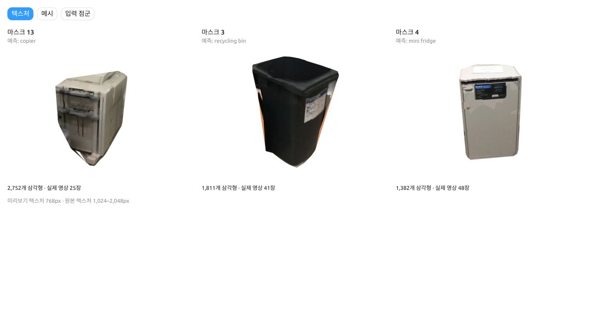
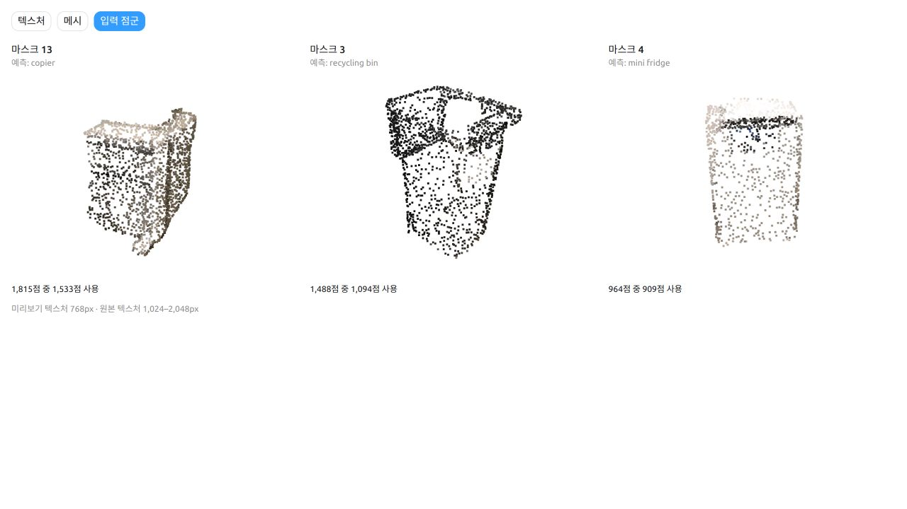
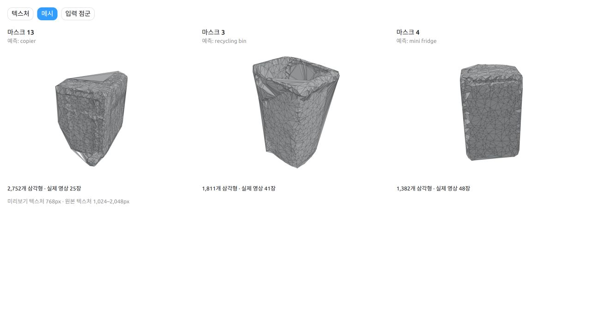
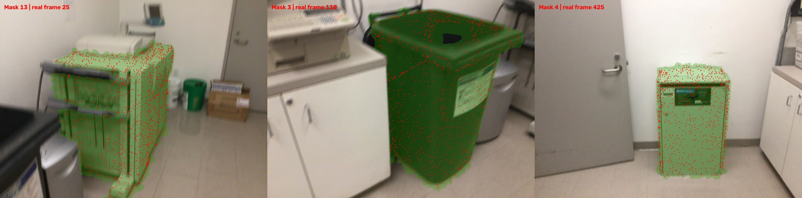

# Task 4 · 객체별 파일 저장

분할된 실제 관측 형상을 객체별 메시로 만들고 GLB 또는 OBJ로 저장한다. 현재 제공하는 합성 예제 파일 형식은 OBJ다.

상태: **개발 scaffold**. 실제 backend는 아직 연결되지 않았으며 `run`은 명시적으로 미구현 오류를 반환한다. 담당자 배정은 팀에서 정한다.

## 작업 범위

- 이 디렉터리의 `pipeline.py`, backend 모듈, 설정, 의존성 설명을 수정한다.
- task 전용 테스트는 `tests/task_4_object_export/`에 추가한다.
- 공통 규약 변경은 별도 PR에서 소비 task와 합의한다.
- 브랜치 예: `task/4-object_export/my-feature`.

## 입력과 출력

| 입력 이름 | artifact kind | 독립 개발용 입력 |
|---|---|---|
| `instances` | `instances` | `examples/fixtures/before/instances.json` |

출력 kind: `objects`. 완성된 형태의 **합성 예제**: [`before/objects.json`](../../../../examples/fixtures/before/objects.json).
공통 규약: [docs/contracts.md](../../../../docs/contracts.md).

## 바로 확인

저장소 루트에서 가상환경을 활성화하고 `python -m pip install -e .`를 먼저 실행한다.

```bash
python -m spacewatch3d check-fixtures --task 4
```

위 명령은 파일·ID·규약만 검증한다. 모델 추론이나 task 알고리즘을 실행하지 않는다.

구현을 연결한 뒤 실행할 명령:

```bash
python -m spacewatch3d run --task 4 --input instances=examples/fixtures/before/instances.json --output outputs/task-4-trial --config src/spacewatch3d/tasks/task_4_object_export/config.example.json
```

`run(request: TaskRequest) -> Path`를 구현하고, 출력 디렉터리를 생성한 뒤 출력 manifest 경로를 반환한다.
현재는 exit code 2의 미구현 오류가 정상이며, 결과 파일을 성공한 것처럼 만들지 않는다.

## 첫 구현 완료 기준

- [ ] 객체별 mesh와 instance_id 연결
- [ ] 객체 로컬 좌표에서 scene 좌표로 가는 world_from_object 저장
- [ ] 색상·텍스처·OBJ 부속 MTL/이미지 경로 유지
- [ ] 관측되지 않은 면은 완전한 실측 형상으로 표기하지 않기
- [ ] 자신의 결과 JSON을 `python -m spacewatch3d validate 결과.json --check-files`로 검증
- [ ] 실행 환경·모델 revision·입력·재현 명령·한계를 README에 기록
- [ ] 합성 fixture 통과와 실제 데이터 성능 평가를 구분해서 보고

## 의존성

공통 환경은 Python 3.10+와 jsonschema만 사용한다. `requirements.txt`는 task 담당자가 검증한 의존성을 기록하는 자리다.
모델별 Python/CUDA 충돌이 있으면 task별 가상환경을 사용해 manifest와 파일로 연결한다.
외부 코드는 `third_party/`, 가중치는 `weights/`, 실제 입력은 `data/`에 두며 Git에 포함하지 않는다.

---

## 실험 기록: OpenMVS 객체별 메시·텍스처 생성

**실행일: 2026-09-28 · 장면: ScanNet `scene0462_00` · 대상: 객체 마스크 13, 3, 4**

SpaCeFormer의 공개 segmentation 결과에서 객체별 점군을 분리하고, OpenMVS로 삼각형 메시와 실제 RGB 기반 텍스처를 생성했다. 객체 3개 모두 OBJ·GLB 출력과 표시를 확인했으며, 메시 생성 단계에서 PLY도 저장됐다. 이 실험은 별도 작업 폴더에서 수행했다. 현재 Task 4의 `pipeline.py` 연결과 `objects` manifest 검증은 아직 남아 있다.

### 1. 생성 결과

아래 결과는 왼쪽부터 **마스크 13 → 3 → 4** 순서다. 객체 이름은 모델의 예측값이며 정답으로 검증하지 않았다.



| 마스크 | 예측 이름 | 원본 점 → 사용 점 | 사용 RGB | 정점 / 삼각형 | 텍스처 해상도 |
|---|---|---:|---:|---:|---|
| 13 | copier | 1,815 → 1,533 | 25장 | 1,390 / 2,752 | 2,048 × 2,048 |
| 3 | recycling bin | 1,488 → 1,094 | 41장 | 920 / 1,811 | 2,048 × 2,048 |
| 4 | mini fridge | 964 → 909 | 48장 | 702 / 1,382 | 1,024 × 1,024 |

미리보기의 텍스처만 최대 768px로 축소했다. 메시의 삼각형 수는 그대로이며, 출력 파일에는 표에 적힌 해상도의 텍스처가 들어 있다. 주황색 면은 유효한 RGB 텍스처가 배정되지 않은 부분이다.

<details>
<summary>입력 점군 · 삼각형 메시 · RGB 투영 비교</summary>

**입력 점군:** 마스크에 포함된 전체 점이다. 이 중 실제 영상에서 가시성이 확인된 점만 복원에 사용했다.



**메시 구조:** 같은 시점에서 본 삼각형 메시와 와이어프레임이다.



**RGB 투영 확인:** 실제 프레임 25·110·425 위에 가시 점을 빨간색, 객체 마스크를 녹색으로 표시했다.



</details>

### 2. 메시 형상과 RGB 텍스처를 만든 방법

```text
SpaCeFormer XYZRGB + 객체 마스크
  → 객체별 점군 분리
  → 깊이·카메라 정보로 점별 가시성 확인
  → ReconstructMesh: 점군을 삼각형 메시로 변환
  → TextureMesh: 실제 RGB 영상으로 UV·텍스처 생성
  → OBJ / GLB / PLY 저장
```

| 단계 | 사용한 입력 | 수행한 작업 |
|---|---|---|
| 객체 분리 | 60,000점·50개 예측 마스크가 있는 공개 JSON | 마스크 13·3·4의 점을 추출 |
| 입력 정합 | 원본 ScanNet 좌표, 실제 깊이·카메라 포즈·내부 파라미터 | 좌표 이동 복원, 관측 영상 연결, 객체별 영상 마스크 생성 |
| 메시 생성 | 분리한 점군과 카메라별 관측 관계 | OpenMVS `ReconstructMesh` 실행 |
| 텍스처 생성 | 생성한 메시와 실제 RGB 영상 | OpenMVS `TextureMesh` 실행 |

**메시 형상은 기존 점군에서 생성했고, RGB 영상의 색상·무늬는 텍스처 생성에 사용했다.** RGB로 점군을 새로 추정하는 `DensifyPointCloud`와 영상 기반 형상 최적화인 `RefineMesh`는 실행하지 않았다. 원본 ScanNet 메시의 면을 결과에 복사하거나 합성 RGB를 사용하지 않았다.

입력 준비에서는 실제 RGB-D 600프레임 중 5프레임 간격의 120개 시점을 검사했다. 깊이 차이 5 cm 미만의 관측을 연결하고, 최소 2개 영상에서 보이는 점과 객체 점을 20개 이상 보는 영상을 사용했다. 영상 마스크의 레이블 전이 최대 거리는 7 cm, 가장자리 확장은 5픽셀로 설정했다.

### 3. 출력 파일과 좌표

| 파일 | 내용 | 사용 방법 |
|---|---|---|
| `mask_XX.glb` | 메시·UV·내부 PNG 텍스처 | 단일 파일로 사용 |
| `mask_XX/textured.obj` + `textured.mtl` + `textured_material_00_map_Kd.jpg` | 메시·UV·재질·외부 텍스처 | 세 파일을 함께 보관 |
| `mask_XX/mesh.ply` | 정점 XYZ·삼각형 면 | 이번 파일에는 RGB·UV 텍스처가 없음 |
| `mask_XX/input_all.ply` | 원본 마스크의 XYZRGB 점군 | 메시 생성 전 입력 확인용 |
| `mask_XX/input_visible.ply` | 가시성 조건을 통과한 XYZRGB 점군 | 실제 메시 생성에 사용한 점 |

`mesh.ply`는 `ReconstructMesh` 실행 때 생성됐다. 이후 별도의 PLY 변환이나 텍스처의 정점 RGB 변환은 수행하지 않았다. GLB는 OpenMVS가 내보낸 외부 PNG를 내부에 넣어 단독으로 열리도록 패키징했다.

OBJ·PLY는 ScanNet의 **Z-up 세계 좌표, m 단위**를 유지한다. GLB는 노드에 X축 -90도 회전을 적용해 **Y-up**으로 표시한다. 변환은 `(x,y,z) → (x,z,-y)`이며 정점 자체와 객체 간 상대 위치는 유지한다. 출력 파일의 피벗을 객체 중심으로 옮기지는 않았고, 미리보기만 중심을 맞춰 표시했다.

### 4. 검증 결과와 한계

- **실행·파일 확인:** 객체별 메시 생성과 OBJ·GLB 텍스처 출력, 총 9개 최종 OpenMVS 명령이 종료 코드 0으로 완료됐다. 정점·면·UV, GLB 내부 이미지, GLB 재로딩과 ZIP 무결성을 확인했다.
- **텍스처 보정 문제:** 현재 설치에서 global/local seam leveling을 켜면 텍스처가 검게 변하는 현상이 발생했다. 최종 결과는 두 옵션을 꺼서 생성했다. 근본 원인은 특정하지 않았으며 영상 간 밝기 경계가 남을 수 있다.
- **표면 완성도:** 세 메시 모두 완전히 닫힌 메시(watertight)가 아니다. 구멍 메우기와 평활화는 끈 상태다. 성긴 점군과 제한된 관측으로 인해 작은 부품·얇은 구조·뒷면의 복원이 부족하다.
- **평가 범위:** 파일 생성과 표시 가능성을 확인한 테스트다. segmentation 정답 비교와 메시 정확도 정량 평가는 수행하지 않았다.

| 마스크 | 텍스처 미배정 삼각형 | 전체 메시 면적 중 미배정 비율 |
|---|---:|---:|
| 13 | 65개 | 약 1.60% |
| 3 | 64개 | 약 10.37% |
| 4 | 18개 | 약 13.90% |

Task 4에 연결할 때는 `instance_id`와 출력 파일의 대응, 객체 로컬 좌표 및 `world_from_object`, 재질 경로와 미관측 표면 상태를 `objects` 규약에 맞춰 기록하고 `validate --check-files`를 실행해야 한다.

### 5. 데이터 출처와 재현 기록

| 자료 | 출처 / 기록 |
|---|---|
| 공개 예측 점군 | [SpaCeFormer 공식 scene0462_00 JSON](https://nvlabs.github.io/SpaCeFormer/assets/pointclouds/scene0462_00.json) |
| 실제 RGB-D·카메라 | [OpenEQA 공개 미러의 해당 장면](https://huggingface.co/datasets/AIGeeksGroup/OpenEQA/blob/main/scannet-v0/121-scannet-scene0462_00.tar) — Meta 공식 호스팅이 아닌 미러 |
| RGB-D 추출 형식 | [OpenEQA 공식 ScanNet 추출 코드](https://github.com/facebookresearch/open-eqa/blob/main/data/scannet/extract-frames.py) |
| 좌표 정합 확인용 원본 | [ScanNet 공개 미러 ZIP](https://huggingface.co/datasets/WHB139426/Scannet/blob/main/scannet-dataset.zip)의 해당 장면 PLY·TXT만 추출 |
| 결과 수치 / 실행 명령 | [result-report.json](assets/openmvs-scene0462-00/result-report.json) · [run-report.json](assets/openmvs-scene0462-00/run-report.json) |
| 입력 URL·크기·SHA-256 | [source-manifest.json](assets/openmvs-scene0462-00/source-manifest.json) |

이번 실험에서는 공개된 segmentation 예측 결과를 사용했으며 모델 추론을 다시 실행하지 않았다. 메시 생성 환경은 Ubuntu 22.04, Python 3.10, OpenMVS **2.4.0**, CPU 4스레드다. OpenMVS 소스 커밋은 [`58117204c86bbb11a0b25b26a8987676cf11274d`](https://github.com/cdcseacave/openMVS/tree/58117204c86bbb11a0b25b26a8987676cf11274d)다.

<details>
<summary>좌표 정합 · 실행 설정 · 로컬 산출물 위치</summary>

공개 점군의 중심 이동은 다음과 같이 복원했다. 단위는 m다.

```text
ScanNet_XYZ = JSON_XYZ + [2.7108800523, 4.4817194939, 1.1537380219]
```

원본 점과의 최근접 대응 오차 중앙값은 약 0.0493 mm였다. 이 값은 점군 좌표 대응 확인값이며 메시 복원 정확도를 뜻하지 않는다. 카메라·점·관측 관계는 OpenMVS `Interface.h` v6 형식의 `scene.mvs`로 저장했다.

각 객체의 입력이 준비된 디렉터리에서 실행한 설정:

```bash
ReconstructMesh -i scene.mvs -o mesh.mvs \
  --min-point-distance 0 --remove-spurious 0 --remove-spikes 1 \
  --close-holes 0 --smooth 0 --crop-to-roi 0 --max-threads 4

TextureMesh -i scene.mvs -m mesh.ply -o textured.mvs \
  --export-type obj --resolution-level 0 --min-resolution 640 \
  --max-texture-size 2048 --close-holes 0 --ignore-mask-label 0 \
  --global-seam-leveling 0 --local-seam-leveling 0 --max-threads 4
```

GLB는 동일 텍스처 설정에서 `-o textured_glb.mvs --export-type glb`로 추가 실행했다. 실제 표면 출력인 `mesh.ply`를 `TextureMesh`에 명시적으로 전달한다.

원본 입력·스크립트·출력·로그는 현재 로컬 환경의 다음 위치에 있다. 이 저장소에는 설명용 이미지와 작은 검증 기록을 추가했다.

```text
/home/kdj/Documents/ChatGPT/capstone design/output/spaceformer_scene0462_openmvs/
├── source/                         # 예측 점군, 실제 RGB-D, 카메라
├── scripts/                        # 입력 준비, OpenMVS 실행, 패키징
├── objects/mask_13/, mask_03/, mask_04/
├── deliverables/                   # GLB, OBJ/MTL/JPG, PLY
├── logs/
└── scene0462_00_openmvs_3objects.zip
```

위 실험 디렉터리에서 재실행할 명령:

```bash
.venv/bin/python scripts/prepare_openmvs.py
.venv/bin/python scripts/run_openmvs.py
.venv/bin/python scripts/package_results.py
```

문서 정리에는 보관된 결과를 사용했다. 메시 생성이나 파일 변환을 다시 실행하지 않았다.

</details>
