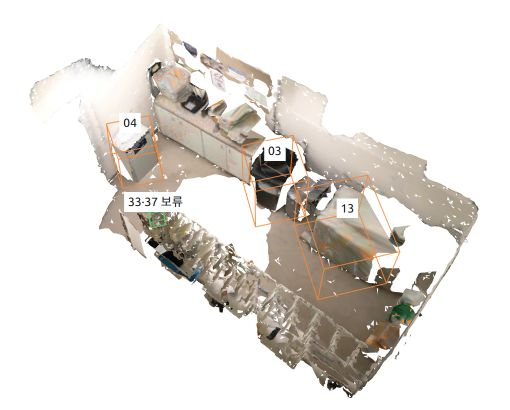
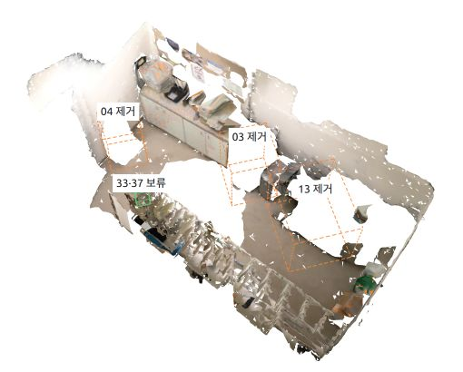

# Task 5a · 공간 정합 및 변화탐지

같은 공간의 두 촬영 회차를 정합한 뒤 객체 대응 및 위치·형상 변화를 판별한다. 공간 정합도 이 task의 책임 범위다.

상태: **개발 scaffold**. 실제 backend는 아직 연결되지 않았으며 `run`은 명시적으로 미구현 오류를 반환한다. 담당자 배정은 팀에서 정한다.

## 작업 범위

- 이 디렉터리의 `pipeline.py`, backend 모듈, 설정, 의존성 설명을 수정한다.
- task 전용 테스트는 `tests/task_5a_change_detection/`에 추가한다.
- 공통 규약 변경은 별도 PR에서 소비 task와 합의한다.
- 브랜치 예: `task/5a-change_detection/my-feature`.

## 입력과 출력

| 입력 이름 | artifact kind | 독립 개발용 입력 |
|---|---|---|
| `before` | `objects` | `examples/fixtures/before/objects.json` |
| `after` | `objects` | `examples/fixtures/after/objects.json` |

출력 kind: `changes`. 완성된 형태의 **합성 예제**: [`changes.json`](../../../../examples/fixtures/changes.json).
공통 규약: [docs/contracts.md](../../../../docs/contracts.md).

## 바로 확인

저장소 루트에서 가상환경을 활성화하고 `python -m pip install -e .`를 먼저 실행한다.

```bash
python -m spacewatch3d check-fixtures --task 5a
```

위 명령은 파일·ID·규약만 검증한다. 모델 추론이나 task 알고리즘을 실행하지 않는다.

구현을 연결한 뒤 실행할 명령:

```bash
python -m spacewatch3d run --task 5a --input before=examples/fixtures/before/objects.json --input after=examples/fixtures/after/objects.json --output outputs/task-5a-trial --config src/spacewatch3d/tasks/task_5a_change_detection/config.example.json
```

`run(request: TaskRequest) -> Path`를 구현하고, 출력 디렉터리를 생성한 뒤 출력 manifest 경로를 반환한다.
현재는 exit code 2의 미구현 오류가 정상이며, 결과 파일을 성공한 것처럼 만들지 않는다.

## 첫 구현 완료 기준

- [ ] 스케일이 검증된 동일 단위는 SE3, 상대 스케일까지 필요하면 Sim3 검토
- [ ] current → baseline 방향의 baseline_from_current 저장
- [ ] 회차별 instance_id가 같다는 이유로 같은 객체라고 가정하지 않기
- [ ] added/removed/moved/shape_changed/unchanged/unknown 및 근거 기록
- [ ] 가림·미관측·정합 실패를 삭제/이동으로 단정하지 않기
- [ ] 자신의 결과 JSON을 `python -m spacewatch3d validate 결과.json --check-files`로 검증
- [ ] 실행 환경·모델 revision·입력·재현 명령·한계를 README에 기록
- [ ] 합성 fixture 통과와 실제 데이터 성능 평가를 구분해서 보고

## 의존성

공통 환경은 Python 3.10+와 jsonschema만 사용한다. `requirements.txt`는 task 담당자가 검증한 의존성을 기록하는 자리다.
모델별 Python/CUDA 충돌이 있으면 task별 가상환경을 사용해 manifest와 파일로 연결한다.
외부 코드는 `third_party/`, 가중치는 `weights/`, 실제 입력은 `data/`에 두며 Git에 포함하지 않는다.

## 변화 탐지 진행 기록 (2026-10-08 정리)

객체별 모델을 만든 뒤 두 객체 집합의 **위치와 형상으로 대응 관계를 찾고, 남은 차이를 판정하는 실험**까지 진행했다. 2026-09-28에 비교 데이터를 준비했고, 2026-10-01에 변화 판정과 전후 토글 시각화를 완료했다.

현재 결과는 **별도 실험 스크립트의 실행 결과**다. 이 디렉터리의 `pipeline.py`는 여전히 `BackendNotImplemented`를 반환하며, `config.example.json`도 `backend: unimplemented` 상태다. 아래 실험의 완료가 공통 `spacewatch3d run --task 5a` 구현 완료를 뜻하지는 않는다.

### 1. 비교 데이터와 입력 역할

SpaCeFormer 공개 예제 `scene0462_00`의 예측 마스크 0–49를 객체 파일로 만들었다. before는 50개 전체, after는 마스크 **3·4·13만 제외하고 나머지 파일을 그대로 복사한 47개 세트**다. 같은 공간을 두 번 촬영한 자료가 아니라, 객체 파일 제거 여부를 검증하기 위해 만든 합성 비교 자료다.

| 항목 | 전 `before_all` | 후 `after_removed_03_04_13` |
|---|---|---|
| 객체 수 | 50개 | 47개 |
| 실제 RGB 영상 텍스처 메시 | 26개 | 23개 |
| 원본 점군의 정점색 메시 | 24개 | 24개 |
| 삼각형 수 | 61,574개 | 55,629개 |
| 구성 | 원본 예측 마스크 전체 | 마스크 3·4·13을 제외한 복사본 |

마스크 3·4·13의 예측 이름은 각각 `recycling bin`, `mini fridge`, `copier`다. 번호는 0부터 시작하며, 이름과 객체 수는 분할 모델의 예측 결과이지 검증된 실제 물체의 정답이 아니다. 텍스처 메시는 OpenMVS 2.4.0으로, 영상 관측이 부족한 객체의 정점색 메시는 Open3D 0.19.0의 Ball Pivoting으로 생성했다.

- **판정 입력:** 객체별 PLY의 XYZ 좌표. 색상, 텍스처, 클래스는 이번 대응 점수에 사용하지 않았다.
- **시각화 입력:** 객체별 GLB. 실제 메시와 색상을 원래 장면 위치에 표시한다.
- **추적·평가 정보:** `objects.json`, 원본 점 인덱스 NPY, 파일 해시. 파일 로딩·원본 보존 확인·사후 평가에 사용한다.

분석 좌표는 **ScanNet Z-up, m 단위**이고, GLB 표시 좌표는 Y-up이다. 표시 축 변환은 `(x, y, z) → (x, z, -y)`이며 분석 좌표와 혼용하지 않는다. 이번 데이터는 같은 좌표계의 복사 세트이므로 `baseline_from_current = I`, scale = 1을 사용했다. after 합집합 점군에서 before 합집합 점군까지의 최근접 거리 RMSE와 최댓값은 모두 0이지만, 이는 데이터 구성을 확인한 결과이며 공간 정합 알고리즘의 성능을 평가한 수치는 아니다.

입력은 저장소 루트 기준 `data/task_5a_change_detection/scene0462_00/`에 있다. [데이터 준비 기록](../../../../data/task_5a_change_detection/scene0462_00/README.md)의 “변화 탐지는 실행하지 않았다”는 문구는 준비 당시 상태이며, 이후의 판정 결과는 아래 실험 기록에 별도로 남겼다.

### 2. 적용한 객체 대응 방법

기본 원칙은 **회차별 ID나 파일명이 같다는 이유로 같은 객체라고 판단하지 않는 것**이다. 매칭 함수에는 익명 XYZ 점군만 전달한다. `mask_id`, `instance_id`, 파일명, 클래스, 원본 점 인덱스, SHA-256, 제거 정답 목록은 매칭 점수에 들어가지 않는다. 제거 정답 목록은 추론 결과를 저장한 다음 평가에만 읽는다.

1. **점군 준비:** 각 객체 내부의 중복 XYZ 좌표를 제거하고, 점들의 평균 위치, 축 정렬 경계 상자(AABB)의 세 변 길이와 대각선, 최근접 탐색용 KD-tree를 구한다. 원본 파일은 수정하지 않는다.
2. **장면 좌표에서 후보 비교:** 50 × 47 = **2,350개 조합**에 대해 중심 거리, 크기 차이, 양방향 최근접 표면 거리, 양방향 겹침을 계산한다.
3. **모호한 후보 보류:** 한 객체의 최선·차선 후보 비용 차이가 0.05 미만이면 관련 후보 연결 성분을 보류한다. 동일하거나 거의 같은 형상의 객체를 임의로 일대일 대응시키지 않는다.
4. **일대일 대응:** 허용 후보에 대해 미대응을 선택할 수 있는 가상 노드를 포함한 선형 할당(`scipy.optimize.linear_sum_assignment`)을 수행한다. 맞는 후보가 없어도 억지로 쌍을 만들지 않는다.
5. **이동 가능 객체 재비교:** 아직 대응되지 않았고 보류 대상도 아닌 객체끼리 크기 대각선 비율이 2 이내인 조합을 다중 PCA 초기화와 강체 point-to-point ICP로 비교한다. 객체의 위치가 달라져도 형상이 같은지 확인하기 위한 단계이며, 스케일은 맞추지 않는다.

장면 좌표 비교 비용은 다음과 같다. 비용이 작을수록 유사한 후보다.

```text
cost = 0.15 × position_error
     + 0.15 × size_error
     + 0.50 × surface_error
     + 0.20 × (1 - overlap)
```

- `position_error`: 중심 거리를 `max(0.10 m, 큰 객체의 AABB 대각선 × 0.25)`로 나누고 1에서 제한한 값.
- `size_error`: AABB 각 변의 길이 차이를 두 객체 중 큰 길이로 나눈 값의 평균.
- `surface_error`: 양방향 최근접 거리를 각각 0.02 m로 나누고 점마다 1에서 제한한 뒤, 두 방향 평균을 다시 평균한 값.
- `overlap`: 0.02 m 이내에 상대 객체의 점이 있는 비율을 양방향으로 구한 뒤 작은 쪽을 선택한 값. 작은 조각이 큰 객체 안에 들어 있다는 이유만으로 완전한 대응으로 인정하지 않기 위해 양방향을 확인한다.

| 설정 | 현재 실험값 |
|---|---|
| 장면 좌표 후보의 중심 거리 | 위 위치 기준 이내 |
| 최소 양방향 겹침 | 0.80 이상 |
| 최대 허용 비용 | 0.25 미만 |
| 모호성 판단 비용 차이 | 0.05 미만 |
| 객체 하나를 미대응으로 두는 비용 | 0.125 |
| 이동 판단 | 원래 중심 변위가 0.02 m 초과 또는 국소 정합 회전이 5° 초과 |

국소 형상 비교는 위치 오차를 비용에서 제외하고 나머지 가중치 합 0.85로 다시 나눈다. ICP로 객체끼리 맞춘 변환은 **객체 대응 확인용**이며 장면 전체 정합을 대체하지 않는다. 이동량은 국소 정합으로 지워 버리지 않고, 장면 좌표에서 `after 중심 - before 중심`으로 별도 기록한다. 이 설정들은 초기 휴리스틱이며 보정된 확률이나 일반 데이터에 검증된 기본값은 아니다.

### 3. 변화 판정과 실험 결과

대응이 확정된 쌍은 위 이동 기준으로 `moved` 또는 `unchanged`를 기록한다. 이번처럼 관측 누락이 없는 완전한 합성 객체 목록에서는 끝까지 미대응인 before를 `removed`, after를 `added`로 기록한다. 대응이 모호한 후보는 `unknown` 그룹으로 남긴다. 실영상에서는 미대응이 가림·촬영 누락 때문일 수 있으므로 이 제거 규칙을 그대로 적용할 수 없다.

| 판정·평가 항목 | 결과 |
|---|---|
| `unchanged` | 45개 대응 확정, 원본 마스크 기준 45개 모두 올바른 대응 |
| `removed` | 마스크 3·4·13, 총 3개 |
| `added` / `moved` | 각각 0개 |
| `unknown` | 전후 각각 마스크 33·37, 2개씩 대응 보류 |
| 제거 참양성 / 오탐 / 누락 | 3 / 0 / 0 |
| 남은 객체의 확정 대응 비율 | 45 / 47 = 95.74% |
| 국소 형상 재비교 조합 | 0개 |

마스크 33·37은 거의 중복된 점군이다. 같은 마스크의 전후 비용은 0, 서로 교차 대응한 비용은 약 0.005482로 차선 후보와의 차이가 0.05보다 작다. 번호를 이용해 두 쌍을 강제로 맞추지 않고 보류했다. 따라서 95.74%는 **확정 대응 비율**이며, 보류 객체를 성공한 대응이나 제거·추가로 집계하지 않았다.

이번 제거 데이터에서는 장면 좌표 대응 이후 남은 after 후보가 없어 국소 PCA/ICP 단계의 실행 조합이 0개였다. 해당 경로는 별도의 합성 회전·이동 검사에서 확인했으며, 실제로 이동한 물체가 있는 재촬영 데이터에 대한 성능은 아직 검증하지 않았다. `shape_changed` 판정과 분할 객체의 합침·나뉨 처리는 구현·검증이 남아 있다.

기록된 검증은 다음과 같다. [판정 검증 기록](../../../../outputs/task_5a_change_detection/scene0462_00_compare_20261001/validation_report.json)의 검사 항목은 모두 통과했다.

- 전 50개, 후 47개가 확정 대응·미대응·보류 중 하나로 빠짐없이 집계된다.
- 두 입력 목록의 순서를 각각 바꿔도 대응, 제거, 보류 결과가 같다.
- 알려진 회전·이동을 준 비대칭 합성 형상에서 국소 정합이 대응을 복구한다.
- 형상이 맞지 않는 객체는 강제로 매칭하지 않고, 구분 불가능한 중복 객체는 보류한다.
- 한쪽 방향만 완전히 겹치는 작은 부분 점군은 양방향 겹침 조건으로 거른다.
- 입력 manifest·GLB·PLY·NPY **293개 파일**의 실행 전후 SHA-256이 같다.

### 4. 전후 토글 시각화

`scene0462_00 · 객체 변화` 화면에서 `전 · 50개`와 `후 · 47개`를 전환하도록 만들었다. 두 상태에서 카메라 위치를 유지하므로 같은 시점에서 객체가 사라진 위치를 확인할 수 있다.

#### 전후 결과 화면

아래는 기존 실험 시각화를 **동일한 카메라 위치·방향·배율**에서 캡처한 화면이다. AI 생성 그림이 아니라 실제 객체 메시와 판정 결과를 렌더링한 것이며, 실험 자체는 마스크 3·4·13의 파일을 인위적으로 제외한 합성 제거 테스트다. 이미지를 누르면 원본 크기로 확인할 수 있다.

| 전: 전체 50개 | 후: 3개 제거 후 47개 |
|---|---|
| [](assets/scene0462-before.png) | [](assets/scene0462-after.png) |

| 화면 표시 | 의미 |
|---|---|
| 전 화면의 `03`, `04`, `13`과 실선 상자 | 제거 테스트 대상 객체가 원래 존재하던 위치 |
| 후 화면의 `03 제거`, `04 제거`, `13 제거`와 점선 상자 | 대응 결과 제거로 판정한 객체의 이전 위치. 점선 내부의 빈 공간을 확인한다. |
| 두 화면의 `33·37 보류` | 두 마스크의 형상이 거의 같아 특정 일대일 대응을 확정하지 못한 그룹. 삭제된 객체를 뜻하지 않는다. |

- 전 상태에서는 제거 대상 03·04·13을 실선 상자로, 후 상태에서는 제거된 위치를 점선 상자로 표시한다.
- 대응 보류 33·37은 하나의 표시 상자로 묶지만, 원래의 객체 메시 두 개는 모두 유지한다.
- 표시 메시의 삼각형 수는 전 61,574개, 후 55,629개다. 점선 상자는 결과 표시용이며 객체 메시가 아니다.
- 미리보기만 좌표를 uint16으로 압축하고 텍스처를 128px로 줄였다. 원본 GLB는 변경하지 않았다.

#### 직접 전후 전환하기

[전후 토글 시각화 HTML](assets/scene0462-change.html)을 이 README의 `assets/`에 함께 저장했다. 장면 데이터와 미리보기 텍스처를 포함하므로 별도 `data/`·`outputs/` 폴더 없이 열 수 있다. Three.js와 OrbitControls는 `esm.sh`에서 불러오므로 인터넷 연결과 WebGL을 지원하는 브라우저가 필요하다.

README에서는 위 정적 이미지를 보고, 인터랙티브 비교는 HTML을 브라우저에서 연다. GitHub의 HTML 파일 링크는 소스 보기로 열리므로, 로컬 저장소 루트에서 아래 명령으로 실행하면 된다.

```bash
python3 -m http.server 8769 --bind 127.0.0.1 --directory src/spacewatch3d/tasks/task_5a_change_detection/assets
```

브라우저에서 [http://127.0.0.1:8769/scene0462-change.html](http://127.0.0.1:8769/scene0462-change.html)을 연다. 확인을 마치면 서버를 실행한 터미널에서 `Ctrl+C`로 종료한다.

1. `전 · 50개`에서 03·04·13의 메시와 실선 상자를 확인한다.
2. `후 · 47개`로 전환해 같은 위치의 메시가 사라지고 점선 상자만 남는지 비교한다. 전후 버튼은 현재 카메라 시점을 유지한다.
3. 드래그 회전·휠 확대 기능으로 다른 시점에서도 확인할 수 있다. 객체를 클릭하면 하단에 마스크 번호·예측 이름·판정 상태가 표시된다.
4. `33·37 보류`는 전후 모두 남아 있는 모호한 대응 그룹으로 읽는다. 이 두 객체를 제거나 추가로 세지 않는다.

정적 PNG 두 장과 HTML은 문서용으로 보관한 2026-10-08 스냅샷이다. 새로운 실험 결과가 생기면 원본 시각화를 재생성한 뒤 HTML과 두 캡처를 함께 갱신해야 한다. 문서용 파일은 무시되는 `outputs/` 대신 이 task의 `assets/` 아래에 두었으며, 원본 GLB와 판정 파일은 수정하지 않았다.

#### 원본과 확인 범위

시각화 원본은 아래 로컬 HTML fragment다. 재생성 코드와 검증 정보는 실험 출력 폴더에 있다.

```text
/home/kdj/.codex/visualizations/2026/09/28/01a0e79d-74a4-7203-83e3-747d3fecebe7/scene-change-toggle.html
```

[시각화 검증 기록](../../../../outputs/task_5a_change_detection/scene0462_00_compare_20261001/visualization_validation.json)에는 736px·360px 폭, 밝은·어두운 테마, 실제 표시 객체 수, 전후 카메라 유지, 키보드 토글, 객체 선택, 가로 넘침과 브라우저 오류 여부를 확인한 결과가 있다. 좌표 기반 브라우저 입력이 반응하지 않아 드래그 회전의 자동 검증은 제외했다. 따라서 기록의 `all_passed`는 위 확인 항목에 한정된다.

### 5. 코드와 결과 위치

현재 실험 출력 폴더는 저장소 루트 기준 `outputs/task_5a_change_detection/scene0462_00_compare_20261001/`이다.

| 파일 | 역할 |
|---|---|
| [`scripts/compare_objects.py`](../../../../outputs/task_5a_change_detection/scene0462_00_compare_20261001/scripts/compare_objects.py) | XYZ 기반 대응, 변화 판정, 사후 평가 |
| [`scripts/verify_results.py`](../../../../outputs/task_5a_change_detection/scene0462_00_compare_20261001/scripts/verify_results.py) | 집계·순서 독립성·합성 이동·보류·원본 보존 검사 |
| [`scripts/build_visualization.py`](../../../../outputs/task_5a_change_detection/scene0462_00_compare_20261001/scripts/build_visualization.py) | 판정 결과를 반영한 전후 토글 HTML 재생성 |
| [`changes.json`](../../../../outputs/task_5a_change_detection/scene0462_00_compare_20261001/changes.json) | 실제 판정, 대응 근거, 정합 정보, 보류 그룹, 설정 |
| [`pairwise_scores.json`](../../../../outputs/task_5a_change_detection/scene0462_00_compare_20261001/pairwise_scores.json) | 2,350개 조합의 비용·겹침·허용 여부 |
| [`evaluation.json`](../../../../outputs/task_5a_change_detection/scene0462_00_compare_20261001/evaluation.json) | 제거 정답 및 원본 마스크 기준 사후 평가 |
| [`environment.json`](../../../../outputs/task_5a_change_detection/scene0462_00_compare_20261001/environment.json) | 분석 환경, 매개변수, 비교 스크립트 SHA-256 |
| [`input_checksums.json`](../../../../outputs/task_5a_change_detection/scene0462_00_compare_20261001/input_checksums.json) | 입력 293개 파일의 SHA-256 및 원본 보존 결과 |
| [`visualization_manifest.json`](../../../../outputs/task_5a_change_detection/scene0462_00_compare_20261001/visualization_manifest.json) | 시각화 경로·해시, GLB 검증, 표시 축·압축 정보 |
| [`README.md`](../../../../outputs/task_5a_change_detection/scene0462_00_compare_20261001/README.md) | 실험 당시 방법·결과·한계 기록 |

`data/`와 `outputs/`는 현재 `.gitignore` 대상이다. **위 데이터뿐 아니라 실험 스크립트도 로컬에만 있으며, 저장소를 새로 clone해도 함께 내려오지 않는다.** 공통 backend 통합 시 필요한 코드는 이 task 디렉터리와 task 전용 테스트로 옮겨야 한다.

### 6. 현재 환경에서 재현

판정 실험에 기록된 환경은 Python 3.10.12, NumPy 2.2.6, SciPy 1.15.3이다. PLY 로딩에 `plyfile`을 사용하며, 2026-10-08에 확인한 기존 가상환경의 설치 버전은 1.1.5다. 데이터 준비에 사용한 OpenMVS/Open3D와 변화 판정 자체의 의존성은 구분한다.

아래 명령은 현재 로컬 입력과 기존 가상환경을 사용하며, 실험 출력 JSON·검증 기록·시각화 HTML을 다시 생성한다.

```bash
cd /home/kdj/Desktop/capstone/spacewatch3d
TASK5A_PYTHON='/home/kdj/Documents/ChatGPT/capstone design/output/spaceformer_scene0462_openmvs/.venv/bin/python'
TASK5A_EXPERIMENT='outputs/task_5a_change_detection/scene0462_00_compare_20261001'

"$TASK5A_PYTHON" "$TASK5A_EXPERIMENT/scripts/compare_objects.py"
"$TASK5A_PYTHON" "$TASK5A_EXPERIMENT/scripts/verify_results.py"
"$TASK5A_PYTHON" "$TASK5A_EXPERIMENT/scripts/build_visualization.py"
```

시각화 재생성에는 기존 `scene-all-objects.html`과 `scene-change-toggle.template.html`도 필요하며, 위치가 `build_visualization.py`에 절대 경로로 지정되어 있다. 예전 확인용 `preview_visualization.py`는 visualize 플러그인 1.0.29 경로를 고정 참조하므로 다른 설치 환경에서는 렌더러 경로를 먼저 확인해야 한다. 위 명령은 별도 실험 재현용이며, 상단의 공통 task 실행 명령과는 다르다.

### 7. 확인된 한계와 다음 작업

이번 결과로 확인한 것은 **같은 좌표계의 객체 집합에서 위치·형상 근거로 대응하고, 인위적으로 제거한 세 파일을 검출하며, 중복 형상은 보류할 수 있다는 점**이다. 독립 재촬영, 부분 관측, 실제 공간 정합, 스케일 추정, 물체의 형상 변화에 대한 성능은 아직 확인하지 않았다.

원본 60,000점 중 716점이 둘 이상의 예측 마스크에 속하고, 제거한 마스크 3·4·13의 점 중 95점은 다른 마스크에도 포함된다. 따라서 세 파일을 제외해도 해당 물체의 모든 공간 점이 완전히 사라지는 것은 아니다. 현재 실험은 이 겹침을 보존한 **객체 파일 제거 테스트**다.

입력은 `spacewatch3d-mask-object-set/1`, 출력은 `spacewatch3d-change-experiment/1`의 실험 전용 형식이며 모두 `pipeline_contract_compatible=false`다. 공통 `objects`/`changes` 규약에 바로 넣거나 공통 validator를 통과한 결과로 취급하지 않는다.

남은 작업은 다음과 같다.

- [ ] 실험 매칭 코드를 task backend와 `tests/task_5a_change_detection/`로 옮기고, 입력·출력 경로와 임계값을 설정으로 분리한다.
- [ ] 회차별 객체 목록을 공통 `objects` manifest에 연결하고, `changes`의 객체 참조·정합 상태·근거 프레임·변위 규약으로 변환한다. 겹치는 예측 마스크의 표현도 정리한다.
- [ ] 실제 두 촬영 회차의 공간 정합을 구현한다. 단위·스케일 확인 후 SE3 또는 Sim3를 선택하고, current → baseline 변환을 저장한다. 정합 실패·겹침 부족은 `unknown`으로 처리한다.
- [ ] 가시성·촬영 범위 근거를 추가해 삭제와 미관측을 구분하고, 같은 외형의 반복 객체 및 부분 분할에 대한 대응 근거를 보강한다.
- [ ] 이동·추가·형상 변화·분할 합침/나뉨을 포함한 별도 데이터로 평가하고, `shape_changed` 판정 기준과 임계값을 검증한다.
- [ ] 통합 출력에 공통 validator를 적용하고, 기존 합성 검증과 실제 재촬영 성능 평가를 분리해 기록한다.
